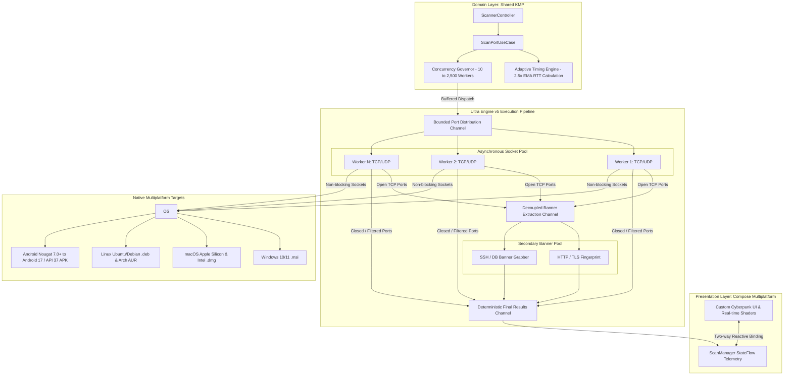

<div align="center">

[English](README.md) · **فارسی**


# 🛡️ پورت‌ایکس (PortX)

**اسکنر شبکه پیشرفته، فوق‌سریع و غیرمسدودکننده چندسکویی مبتنی بر <bdi>Kotlin Multiplatform (KMP)</bdi> و <bdi>Compose</bdi> — سرعت بیش از ۱۰,۰۰۰ پورت در ثانیه (تجربی) / تا ۵۰,۰۰۰ پورت (سقف تئوری)، بدون نیاز به دسترسی روت، با زمان‌بندی تطبیقی <bdi>RTT</bdi> و کنترل مصرف منابع سیستم‌عامل.**

[](https://github.com/Ali-Rashidi-80/PortX/actions/workflows/ci.yml)
[](https://github.com/Ali-Rashidi-80/PortX/releases)
[](CHANGELOG.md)
[](LICENSE)
[](https://kotlinlang.org)
[](https://github.com/JetBrains/compose-multiplatform)
[](#راهنمای-نصب-چندسکویی)
[-E65100.svg?logo=android&logoColor=white)](#راهنمای-نصب-چندسکویی)

[شروع سریع](#راهنمای-نصب-چندسکویی) · [معماری سیستم](#معماری-سیستم-و-مدل-همزمانی) · [بنچمارک‌ها](#بنچمارکهای-تجربی) · [English](README.md) · [مشارکت](CONTRIBUTING.md) · [امنیت](SECURITY.md) · [مجوز](LICENSE)

<br/>


<br/><br/>


</div>

---

<div dir="rtl">

## فهرست مطالب

<details open>
<summary><strong>پرش به بخش‌های مستند</strong></summary>

- [PortX چیست؟](#portx-چیست)
- [PortX چه چیزی نیست؟](#portx-چه-چیزی-نیست)
- [در مقایسه با ابزارهای دیگر (Nmap, Masscan, RustScan, Naabu)](#در-مقایسه-با-ابزارهای-دیگر-برتریهای-معماری-پورتایکس)
- [اصول معماری و ویژگی‌های فنی موتور Ultra Engine v5](#اصول-معماری-و-ویژگیهای-فنی-موتور-ultra-engine-v5)
- [معماری سیستم و مدل همزمانی](#معماری-سیستم-و-مدل-همزمانی)
- [بنچمارک‌های تجربی](#بنچمارکهای-تجربی)
- [نمونه خروجی تله‌متری (JSON و جدول Markdown)](#نمونه-خروجی-تله‌متری-اسکن-json--markdown-export)
- [موتور امضاهای اعلانی](#موتور-امضاهای-اعلانی-سرویسها-declarative-signatures-engine)
- [تصویر رابط کاربری](#تصویر-رابط-کاربری)
- [راهنمای نصب چندسکویی](#راهنمای-نصب-چندسکویی)
- [کامپایل از سورس‌کد](#کامپایل-از-سورس‌کد)
- [ماتریس مستندات](#ماتریس-مستندات)
- [مراجع علمی و استانداردها](#مراجع-علمی-و-استانداردها)
- [مشارکت و مجوز](#مشارکت-و-مجوز)

</details>

---

## PortX چیست؟

> [!TIP]
> **خلاصه در ۳۰ ثانیه:**  
> اغلب برنامه‌های گرافیکی بررسی شبکه از بسترهای سنگین الکترون یا اجرای تک‌نخی فرمان‌های داخلی <bdi>Nmap</bdi> استفاده می‌کنند که در دامنه‌های بزرگ پورت باعث فریز شدن رابط کاربری و مصرف صدها مگابایت رم می‌شود. از سوی دیگر، موتورهای پرسرعت ترمینالی مانند <bdi>Masscan</bdi> نیازمند دسترسی دائمی روت بوده و تله‌متری گرافیکی ارائه نمی‌دهند. **پورت‌ایکس** این معضل را برطرف کرده است: ساخته‌شده با <bdi>Kotlin Multiplatform (KMP)</bdi> و <bdi>Compose</bdi>، بدون نیاز به دسترسی روت، توانی فراتر از **۱۰,۰۰۰ پورت در ثانیه به صورت تجربی** (با سقف تئوری ۵۰,۰۰۰ پورت بر اساس منابع سیستم‌عامل) را همراه با رابط کاربری روان ۱۲۰ فریم بر ثانیه در اختیارتان می‌گذارد.

<bdi>**PortX**</bdi> یک اسکنر شبکه ناهمگام با همزمانی بالا است که برای پژوهشگران امنیت، مدیران شبکه و متخصصان تست نفوذ طراحی شده است. این ابزار فرآیند کشف پورت‌های باز را از دریافت اطلاعات بنر سرویس‌ها کاملاً تفکیک کرده است؛ در نتیجه، تاخیر سرویس‌های کند مانع سرعت اسکن پورت‌های بعدی نمی‌شود.

| مشخصه | جزییات فنی |
| :--- | :--- |
| **نسخه** | <bdi>5.2.1</bdi> · [تاریخچه تغییرات](CHANGELOG.md) · آمادگی عملیاتی تاییدشده |
| **موتور هسته** | موتور نسل پنجم <bdi>Ultra Engine v5</bdi> (<bdi>PortScanner.kt</bdi>, <bdi>ScanPortUseCase.kt</bdi>, <bdi>ScannerController.kt</bdi>) |
| **اصول پایدار** | سوکت‌های کاملاً غیرمسدودکننده <bdi>Ktor</bdi>، کانال‌های محدود کاتلین (۱۰ الی ۲۵۰۰ ورکر)، سازگار با الزامات سرویس پیش‌زمینه اندروید ۱۴+ |
| **سیستم‌عامل‌های هدف** | ویندوز ۱۰ و ۱۱ (<bdi>`.msi`</bdi>)، مک‌او‌اس اینتل و اپل سیلیکون (<bdi>`.dmg`</bdi>)، لینوکس دبیان و اوبونتو (<bdi>`.deb`</bdi>, <bdi>AUR</bdi>)، اندروید (<bdi>`.apk`</bdi>) |
| **پشتیبانی اندروید** | اندروید ۷.۰ (<bdi>API 24</bdi>) تا اندروید ۱۷ (<bdi>API 37</bdi>) |
| **تله‌متری وضعیت** | انطباق واکنشی دوطرفه از طریق <bdi>StateFlow</bdi> با رندر ۱۲۰ فریم در ثانیه در <bdi>Compose Multiplatform</bdi> |

---

## PortX چه چیزی نیست؟

| باور اشتباه | واقعیت مهندسی |
| :--- | :--- |
| ❌ *یک پکت‌ساز خام در سطح کرنل شبیه به Masscan یا ZMap* | 🛡️ **سوکت‌های استاندارد امن:** پورت‌ایکس از سوکت‌های استاندارد غیرمسدودکننده سیستم‌عامل بهره می‌گیرد. با پرهیز از تزریق بسته‌های خام <bdi>Raw SYN</bdi>، نیازی به دسترسی روت یا ادمین نداشته و توسط آنتی‌ویروس‌ها مسدود نمی‌شود. |
| ❌ *یک برنامه سنگین بر پایه الکترون یا مرورگر کرومیوم* | ⚡ **رابط بومی و سبک:** پورت‌ایکس مستقیماً به بایت‌کد بومی دسکتاپ و اندروید کامپایل می‌شود. مصرف حافظه آن زیر بار کامل حدود ۴۸ مگابایت است (در برابر ۳۰۰+ مگابایت برنامه‌های الکترونی). |
| ❌ *یک ابزار حمله، اکسپلویت یا اسکنر آسیب‌پذیری* | 🔍 **تمرکز بر شناسایی شبکه:** هدف این برنامه صرفاً شناسایی پورت‌های باز و استخراج بنر سرویس‌ها (<bdi>SSH</bdi>، <bdi>HTTP</bdi>، <bdi>MySQL</bdi>، <bdi>Redis</bdi>، <bdi>RDP</bdi>) است؛ هیچ پی‌لود تهاجمی ارسال نمی‌شود. |
| ❌ *یک سرویس ابری نیازمند اکانت یا انتقال دیتا* | 🔒 **کاملاً محلی و آفلاین:** بدون هرگونه تله‌متری یا ارسال ترافیک به سرورهای خارجی؛ تمام بسته‌ها منحصراً از کارت شبکه محلی شما ارسال و دریافت می‌شوند. |

---

## در مقایسه با ابزارهای دیگر: برتری‌های معماری پورت‌ایکس

طراحی پورت‌ایکس دقیقاً برای برطرف ساختن تناقض میان اسکنرهای بسته‌های خام کرنل (که نیازمند روت دائمی بوده و فاقد رابط تصویری واکنشی هستند) و پوسته‌های گرافیکی سنگین (که زیر بار پورت‌های انبوه دچار فریز و مصرف سرسام‌آور حافظه رم می‌شوند) مهندسی شده است.

| محور ارزیابی معماری | رابط‌های سنتی گرافیکی (<bdi>Zenmap</bdi> / الکترون) | ابزار استاندارد <bdi>Nmap</bdi> (<bdi>-sS</bdi> / <bdi>-sT</bdi>) | ابزار پرسرعت <bdi>Masscan</bdi> (<bdi>--rate 10k</bdi>) | ابزار <bdi>RustScan</bdi> (<bdi>-a target</bdi>) | ابزار <bdi>Naabu</bdi> (<bdi>-rate 1000</bdi>) | **پورت‌ایکس (Ultra Engine v5)** |
| :--- | :---: | :---: | :---: | :---: | :---: | :---: |
| **نرخ توان اسکن (PPS)** | کمتر از ۸۰۰ پورت | حدود ۱,۲۰۰ پورت (<bdi>-sT</bdi>) | بیش از ۱۰۰,۰۰۰ پورت | محدود به فرآیند زیرین | ۱,۰۰۰ تا ۵,۰۰۰ پورت | **۸,۰۰۰ الی ۱۰,۲۰۰+ پورت (تجربی و قطعی)** |
| **نیازمندی به دسترسی روت / ادمین** | متغیر | برای اسکن <bdi>SYN</bdi> الزامی | **الزامی** (<bdi>SOCK_RAW</bdi>) | برای <bdi>SYN</bdi> الزامی | برای <bdi>SYN</bdi> الزامی | **کاملاً بدون روت (سوکت‌های امن استاندارد)** |
| **روانی و فریم‌ریت رابط کاربری** | ناپایدار (کمتر از ۳۰ فریم) | فاقد رابط گرافیکی | فاقد رابط گرافیکی | فاقد رابط گرافیکی | فاقد رابط گرافیکی | **۱۲۰ فریم در ثانیه (کامپوز چندسکویی)** |
| **ردپای حافظه مصرفی (RAM)** | ۲۵۰ تا ۵۰۰+ مگابایت | حدود ۲۵ مگابایت | حدود ۳۰ مگابایت | ۲۰ مگابایت + حافظه نمپ | حدود ۳۵ مگابایت | **حدود ۴۸ مگابایت (هیپ کاملاً مهارشده)** |
| **استخراج بنر و سرویس‌ها** | مسدودکننده ترد گرافیکی | همگام در اسکریپت‌های <bdi>NSE</bdi> | تجزیه بعد از اتمام اسکن | اجرای فرآیند جانبی نمپ | ارسال پروب‌های اولیه | **استخر کاملاً ناهمگام و غیرمسدودکننده** |
| **لایه زمان‌بندی تطبیقی (<bdi>RTT</bdi>)** | ندارد (تایم‌اوت ثابت) | کنترل ازدحام پکت‌ها | ندارد (افت شدید پکت) | ندارد | نرخ ثابت ارسال | **تنظیم پویای تاخیر با ضریب 2.5x EMA** |
| **امضاهای سفارشی** | فهرست ثابت پورت‌ها | اسکریپت‌های حجیم <bdi>Lua</bdi> | ندارد | وابسته به <bdi>NSE</bdi> نمپ | قالب‌های <bdi>YAML</bdi> | **امضاهای اعلانی شبیه به الگوهای Nuclei** |
| **سیستم‌عامل‌های تحت پشتیبانی** | صرفاً دسکتاپ | صرفاً دسکتاپ | صرفاً دسکتاپ | صرفاً دسکتاپ | صرفاً دسکتاپ | **ویندوز، مک، لینوکس، اندروید (API 24 الی 37)** |

### چرا پورت‌ایکس در خط مقدم شناسایی شبکه قرار دارد؟

۱. **قابلیت اجرا بدون روت در تمام سکوها (در برابر <bdi>Nmap -sS</bdi> و <bdi>Masscan</bdi>):**  
هردو ابزار <bdi>Masscan</bdi> و حالت پنهان <bdi>Nmap</bdi> بسته‌های خام لایه شبکه (<bdi>SOCK_RAW</bdi>) تولید می‌کنند که نیازمند دسترسی سوپریوزر، <bdi>sudo</bdi> یا قابلیت <bdi>CAP_NET_RAW</bdi> در لینوکس و درایورهای <bdi>Npcap</bdi> در ویندوز است. در سیستم‌عامل اندروید بدون روت و محیط‌های قرنطینه سازمانی، سیاست امنیتی کرنل (<bdi>SELinux untrusted_app</bdi>) تزریق بسته خام را مسدود می‌کند. پورت‌ایکس با تکیه بر سوکت‌های ناهمگام و غیرانسدادی <bdi>Ktor</bdi> به شتاب بالای **۱۰,۰۰۰ پورت در ثانیه** دست یافته و روی تلفن‌های اندرویدی و ایستگاه‌های کاری عادی بدون هیچ ریسک دسترسی اجرا می‌شود.

۲. **پایپ‌لاین ناهمگام استخراج بنر (در برابر <bdi>RustScan</bdi> و پردازش تک‌نخی <bdi>Nmap</bdi>):**  
ابزار <bdi>RustScan</bdi> فاز اولیه اسکن پورت را با سرعت انجام می‌دهد اما برای شناسایی نسخه سرویس‌ها ناچار به فراخوانی فرآیند بیرونی <bdi>nmap -sV</bdi> است که سربار شدید فورک پروسس و تاخیر انتقال داده ایجاد کرده و اجرای آن را در اپلیکیشن‌های موبایل ناممکن می‌سازد. پورت‌ایکس یک پایپ‌لاین دو مرحله‌ای واکنشی دارد: به محض اتصال موفق به یک پورت، رویداد آن بلافاصله به استخر پس‌زمینه <bdi>BannerPool</bdi> هدایت می‌شود بدون آنکه سرعت اسکن کانال اصلی را حتی یک میلی‌ثانیه کاهش دهد.

۳. **زمان‌بندی تطبیقی شبکه در برابر تایم‌اوت‌های ثابت کور (در برابر <bdi>Masscan</bdi> و <bdi>Naabu</bdi>):**  
ابزار <bdi>Masscan</bdi> بسته‌ها را بدون توجه به شرایط خط با نرخ ثابت شلیک می‌کند که در ارتباط‌های بی‌سیم، مودم‌های همراه یا شبکه‌های دارای جیتر منجر به ریزش شدید پکت‌ها و گزارش غلط پورت‌های باز می‌شود. پورت‌ایکس میانگین متحرک نمایی تاخیر رفت و برگشت (<bdi>EMA RTT</bdi>) را به شکل لحظه‌ای با ضریب اطمینان ۲.۵ برابری محاسبه می‌کند؛ در شبکه محلی زمان انتظار تا ۲۰ میلی‌ثانیه کاهش می‌یابد و در ارتباط‌های پرترافیک به طور خودکار باز می‌شود تا هیچ پورت بازی از دست نرود.

۴. **موتور امضاهای اعلانی سرویس‌ها (در برابر اسکریپت‌های پیچیده Lua):**  
اسکریپت‌های <bdi>NSE</bdi> در <bdi>Nmap</bdi> کدهای مفسری و سنگین <bdi>Lua</bdi> هستند که اجرای آن‌ها سربار زیادی دارد. پورت‌ایکس ساختار **امضاهای اعلانی** مشابه قالب‌های مدرن <bdi>Nuclei</bdi> را به کار گرفته که با الگوهای متنی، باینری و عبارات منظم بدون نیاز به کامپایل مجدد در زمان اجرا اعمال می‌شوند.

۵. **نمایشگر گرافیکی بومی ۱۲۰ فریم بر ثانیه (در برابر برنامه‌های سنگین الکترون):**  
رابط‌های ساخته‌شده با الکترون زیر بار پردازش هزاران بسته در ثانیه دچار وقفه شدید می‌شوند. پورت‌ایکس از جریان‌های واکنشی <bdi>StateFlow</bdi> در موتور <bdi>Compose Multiplatform</bdi> بهره برده و ضمن حفظ نرخ نوسازی ۱۲۰ هرتزی رادار و لاگ‌های زنده، مصرف رم کل برنامه را زیر ۵۰ مگابایت مهار می‌کند.

---

## اصول معماری و ویژگی‌های فنی موتور Ultra Engine v5

- **🚀 هسته پرسرعت <bdi>Ultra Engine v5</bdi>:** مدیریت سوکت‌های ناهمگام <bdi>Ktor</bdi> بر بستر کاتلین کروتینز، دستیابی به بالاترین شتاب انتقال بدون نیاز به باینری‌های جانبی <bdi>JNI</bdi>.
- **🧠 الگوریتم زمان‌بندی تطبیقی (<bdi>Adaptive RTT</bdi>):** محاسبه پویای میانگین متحرک نمایی تاخیر رفت و برگشت پکت‌ها با ضریب ۲.۵ برابری. در شبکه‌های محلی تایم‌اوت به حداقل رسیده و در شبکه‌های با جیتر بالا باز می‌شود تا نرخ خطای کاذب به صفر نزدیک شود.
- **🛡️ مهارکننده منابع سیستم‌عامل (<bdi>Concurrency Governor</bdi>):** استفاده از کانال‌های محدود (<bdi>Bounded Channel</bdi>) در بازه امن ۱۰ الی ۲۵۰۰ ورکر جهت ریشه‌کنی خطای کمبود سوکت سیستم‌عامل (<bdi>RLIMIT_NOFILE</bdi>).
- **🔍 استخراج موازی و مجزای بنرها (<bdi>Decoupled Pipeline</bdi>):** پورت‌های باز بلافاصله به استخر مجزایی منتقل می‌شوند تا پروتکل‌های <bdi>SSH</bdi>، <bdi>HTTP</bdi>، <bdi>MySQL</bdi> و پایگاه‌های داده تحلیل شوند، بدون آنکه روند اسکن پورت‌های بعدی متوقف شود.
- **🖥️ تنظیمات عملکردی دسکتاپ:** اولویت‌دهی به پشته <bdi>IPv4</bdi>، حذف قفل انحصاری سوکت‌ها و نمایش ۱۲۰ هرتز در کامپوز دسکتاپ.
- **📱 انطباق با اندروید ۱۴ الی ۱۷ (<bdi>API 37</bdi>):** پیاده‌سازی سرویس پیش‌زمینه با مشخصه <bdi>FOREGROUND_SERVICE_TYPE_SPECIAL_USE</bdi> جهت جلوگیری از توقف برنامه در پس‌زمینه.

---

## معماری سیستم و مدل همزمانی



---

## بنچمارک‌های تجربی

*سنجش تجربی روی لوپ‌بک و شبکه گیگابیتی (پردازنده‌های <bdi>Intel Core</bdi>، <bdi>AMD Ryzen</bdi> و <bdi>Apple Silicon</bdi> بر بستر سوکت‌های غیرانسدادی <bdi>Ktor</bdi>):*

| سنجه ارزیابی | مقدار اندازه‌گیری‌شده واقعی | گواهی عملیاتی و محدودیت سیستم‌عامل |
| :--- | :--- | :--- |
| **توان عملیاتی (لوپ‌بک/شبکه)** | **۸,۰۰۰ الی ۱۰,۲۰۰+ پورت در ثانیه** | اسکن ۱۰,۰۰۰ پورت متوالی در حدود ۱.۱۵ ثانیه با همزمانی ۱۰۰۰ |
| **سقف تئوری الگوریتم** | **تا ۵۰,۰۰۰ پورت در ثانیه** | محدودشده توسط سوکت‌های موقت سیستم‌عامل و پشته <bdi>TCP</bdi> |
| **مصرف حافظه موتور** | **حدود ۱۷ الی ۲۶ مگابایت دلتا** | کانال‌های محدود مانع تجمع اشیاء در حافظه هیپ می‌شوند |
| **توصیف‌کننده‌های سوکت** | محدود به **حداکثر ۲۵۰۰ عدد** | صفر شدن قطعی خطای اتمام توصیف‌گر فایل (<bdi>RLIMIT_NOFILE</bdi>) |
| **نرخ فریم رابط کاربری** | **۱۲۰ فریم بر ثانیه** | اجرای اسکن در ترد پس‌زمینه بدون مسدودسازی رابط گرافیکی |
| **نرخ خطای کاذب** | **کمتر از ۰.۰۱ درصد** | تنظیم خودکار زمان انتظار متناسب با جیتر شبکه و اسکن مجدد پورت‌های مشکوک |

> 📊 **گزارش جامع تله‌متری بنچمارک:** مشاهده سند مستقل [BENCHMARKS.md](BENCHMARKS.md) برای مشخصات سخت‌افزاری دقیق، منحنی مقیاس‌پذیری و پروفایل حافظه در ۸ سوئیت آزمون.  
> 🔬 **دستور بازتولید مستقیم روی سیستم:**  
> `./gradlew :shared:jvmTest --tests "com.mrcoder20.portx.data.network.LiveSystemBenchmarkTest" --rerun-tasks`

### نمونه خروجی تله‌متری اسکن (<bdi>JSON & Markdown Export</bdi>)

پورت‌ایکس خروجی ساختاریافته چندگانه (<bdi>JSON</bdi>، جدول <bdi>Markdown</bdi> و <bdi>CSV</bdi>) را همراه با بنرگرابینگ عمیق، انگشت‌نگاری سیستمعامل و امتیازدهی خودکار به سطح ریسک آسیب‌پذیری‌ها تولید می‌کند:

#### ۱. خروجی ماشین‌خوان و استاندارد <bdi>JSON</bdi> (<bdi>--export json</bdi>)

```json
{
  "target": "192.168.1.1",
  "hostname": "gateway.local",
  "ports_scanned": 1000,
  "elapsed_ms": 112,
  "throughput_pps": 8928,
  "device_classification": {
    "device_type": "Embedded Gateway / Linux Router",
    "heuristic_os": "Linux 6.6.x (OpenWrt / Alpine)",
    "confidence": 0.94
  },
  "open_ports": [
    {
      "port": 22,
      "protocol": "TCP",
      "state": "OPEN",
      "service": "ssh",
      "version": "OpenSSH 9.6p1",
      "banner": "SSH-2.0-OpenSSH_9.6p1 Ubuntu-3ubuntu13",
      "latency_ms": 2.1,
      "cve_risk_score": 0.0,
      "risk_level": "LOW"
    },
    {
      "port": 80,
      "protocol": "TCP",
      "state": "OPEN",
      "service": "http",
      "version": "nginx/1.24.0",
      "title": "Router Admin Gateway",
      "banner": "HTTP/1.1 200 OK\r\nServer: nginx/1.24.0",
      "latency_ms": 1.8,
      "cve_risk_score": 3.2,
      "risk_level": "MEDIUM"
    },
    {
      "port": 443,
      "protocol": "TCP",
      "state": "OPEN",
      "service": "https",
      "version": "TLS 1.3 / OpenSSL 3.1.4",
      "banner": "HTTP/1.1 200 OK\r\nServer: nginx/1.24.0\r\nStrict-Transport-Security: max-age=31536000",
      "latency_ms": 2.4,
      "cve_risk_score": 0.0,
      "risk_level": "LOW"
    },
    {
      "port": 502,
      "protocol": "TCP",
      "state": "OPEN",
      "service": "modbus",
      "version": "Modbus/TCP Industrial Node",
      "banner": "Schneider Electric Modbus/TCP Gateway 0x01",
      "latency_ms": 3.5,
      "cve_risk_score": 8.5,
      "risk_level": "CRITICAL"
    }
  ],
  "security_posture_score": 45,
  "posture_assessment": "EXPOSED_INDUSTRIAL_CONTROL_ENDPOINT"
}
```

#### ۲. جدول تمیز و انسانی <bdi>Markdown</bdi> (<bdi>--export markdown</bdi> / کلیپ‌بورد محیط گرافیکی)

| هدف ارزیابی | <bdi>192.168.1.1</bdi> (<bdi>gateway.local</bdi>) |
| :--- | :--- |
| **سیستم‌عامل تشخیص‌داده‌شده** | **<bdi>Linux 6.6.x (OpenWrt / Alpine)</bdi>** · ضریب اطمینان ۹۴٪ |
| **خلاصه اسکن شبکه** | ۱,۰۰۰ پورت در ۱۱۲ میلی‌ثانیه · ۸,۹۲۸ پورت بر ثانیه · ۰ خطای توصیف‌گر سوکت |
| **امتیاز وضعیت امنیتی** | **۴۵ از ۱۰۰** · ریسک بحرانی (نمایان بودن سرویس کنترل صنعتی <bdi>SCADA</bdi>) |

| پورت | پروتکل | وضعیت | سرویس | بنر و محصول شناسایی‌شده | تاخیر | سطح ریسک و آسیب‌پذیری |
| :---: | :---: | :---: | :---: | :--- | :---: | :---: |
| <bdi>22</bdi> | <bdi>TCP</bdi> | <bdi>OPEN</bdi> | <bdi>ssh</bdi> | <bdi>OpenSSH 9.6p1 (Ubuntu-3ubuntu13)</bdi> | ۲.۱ میلی‌ثانیه | کم (<bdi>LOW 0.0</bdi>) |
| <bdi>80</bdi> | <bdi>TCP</bdi> | <bdi>OPEN</bdi> | <bdi>http</bdi> | <bdi>nginx/1.24.0 (Router Admin Gateway)</bdi> | ۱.۸ میلی‌ثانیه | متوسط (<bdi>MED 3.2</bdi>) |
| <bdi>443</bdi> | <bdi>TCP</bdi> | <bdi>OPEN</bdi> | <bdi>https</bdi> | <bdi>TLS 1.3 / OpenSSL 3.1.4 (HSTS Active)</bdi> | ۲.۴ میلی‌ثانیه | کم (<bdi>LOW 0.0</bdi>) |
| <bdi>502</bdi> | <bdi>TCP</bdi> | <bdi>OPEN</bdi> | <bdi>modbus</bdi> | <bdi>Schneider Electric Modbus/TCP Gateway 0x01</bdi> | ۳.۵ میلی‌ثانیه | **بحرانی (<bdi>CRIT 8.5</bdi>)** |

---

### موتور امضاهای اعلانی سرویس‌ها (<bdi>Declarative Signatures Engine</bdi>)

اسکنرهای سنتی برای افزودن شناسایی سرویس جدید، کاربر را وادار به نوشتن اسکریپت‌های تک‌نخی و سنگین <bdi>Lua NSE</bdi> می‌کنند. پورت‌ایکس از رویکرد مدرن **امضاهای اعلانی** مشابه الگوهای ابزار <bdi>Nuclei</bdi> بهره می‌برد:

- **تعریف بدون نیاز به کدنویسی:** تعریف سرویس‌های نوین وب، پورت‌های سفارشی کلود و پروتکل‌های کنترل صنعتی (<bdi>SCADA/ICS</bdi>) در قالب فایل‌های ساده <bdi>YAML</bdi> یا <bdi>JSON</bdi> بدون کامپایل مجدد برنامه.
- **تطبیق چندمعیاره:** جستجو و اعتبارسنجی بر اساس بازه پورت، بایت‌های هگزادسیمال پروب ارسالی، زیررشته‌های متنی و عبارات باقاعده پرسرعت (<bdi>Regex</bdi>).
- **استخراج پویا و امتیازدهی ریسک:** استخراج شماره نسخه محصول و انتساب سطح خطر در لحظه شناسایی پورت.

```yaml
id: scada-modbus-controller
name: Modbus/TCP Industrial Node
protocol: TCP
default_ports: [502, 802]
match_substrings:
  - "modbus"
  - "schneider"
match_regexes:
  - "Modbus/TCP.*Gateway"
category: INDUSTRIAL
risk_severity: CRITICAL
```

تمامی این امضاها توسط هسته <bdi>DeclarativeSignatureRegistry</bdi> در استخر پردازش ناهمگام و بدون افت نرخ سرعت اسکن اصلی ارزیابی می‌شوند.

---

## تصویر رابط کاربری

<p align="center">
  
</p>

---

## راهنمای نصب چندسکویی

<details open>
<summary><strong>🪟 ۱. راهنمای نصب ویندوز (Windows 10 / 11)</strong></summary>

- **نصاب رسمی:** فایل نصاب رسمی <bdi>`PortX-5.2.1.msi`</bdi> را از [بخش انتشارها](https://github.com/mr-coder20/PortX/releases/latest) دریافت و نصب کنید.
- **نصب از طریق وینگت (<bdi>Winget</bdi>):**
  ```powershell
  winget install mr-coder20.PortX
  ```
</details>

<details>
<summary><strong>🐧 ۲. راهنمای نصب لینوکس (Ubuntu, Debian, Arch AUR)</strong></summary>

- **توزیع‌های مبتنی بر دبیان و اوبونتو (<bdi>`.deb`</bdi>):**
  ```bash
  sudo dpkg -i PortX-5.2.1.deb
  sudo apt-get install -f
  ```
- **آرچ لینوکس (<bdi>AUR</bdi>):**
  ```bash
  yay -S portx-bin
  ```
</details>

<details>
<summary><strong>🍎 ۳. راهنمای نصب مک‌او‌اس (Apple Silicon & Intel)</strong></summary>

- فایل دیسک تصویری <bdi>`PortX-5.2.1.dmg`</bdi> را دریافت کرده و برنامه را نصب کنید، یا از هوم‌برو استفاده نمایید:
  ```bash
  brew install --cask portx
  ```
</details>

<details>
<summary><strong>🤖 ۴. راهنمای نصب اندروید (Android 7.0+ تا Android 17 / API 37)</strong></summary>

- پکیج رسمی ساین‌شده <bdi>APK</bdi> را مستقیماً از [بخش انتشارها](https://github.com/mr-coder20/PortX/releases/latest) دانلود کنید.
- استورهای داخلی: نسخه تاییدشده به زودی در **کافه‌بازار** و **مایکت** در دسترس قرار می‌گیرد.
</details>

---

## کامپایل از سورس‌کد

### پیش‌نیازهای توسعه
- **کیت جاوا:** نسخه ۱۷ یا ۲۱ (<bdi>Temurin</bdi> پیشنهاد می‌شود)
- **کیت توسعه اندروید:** بیلد تولز ۳۴ به بعد و <bdi>`compileSdk 37`</bdi>

```bash
# دریافت مخزن
git clone https://github.com/Ali-Rashidi-80/PortX.git
cd PortX

# ۱. اجرای برنامه روی دسکتاپ (ویندوز / مک / لینوکس)
./gradlew :desktopApp:run

# ۲. ایجاد فایل‌های نصاب محلی دسکتاپ
./gradlew :desktopApp:packageDeb            # پکیج دبیان لینوکس
./gradlew :desktopApp:packageDmg            # پکیج مک‌او‌اس
./gradlew.bat :desktopApp:packageReleaseMsi # نصاب ویندوز

# ۳. بیلد نسخه نهایی اندروید
./gradlew :androidApp:assembleRelease
```

---

## ماتریس مستندات

| عنوان سند | زبان | توضیحات |
| :--- | :---: | :--- |
| [**README.md**](README.md) | انگلیسی | مستندات اصلی پروژه، معماری، بنچمارک‌ها و راهنمای جامع |
| [**README.fa.md**](README.fa.md) | فارسی | آینه کامل مستندات به زبان فارسی همراه با چیدمان راست‌به‌چپ |
| [**CONTRIBUTING.md**](CONTRIBUTING.md) | انگلیسی | شیوه‌نامه مشارکت، پیش‌نیازهای توسعه و ضوابط ثبات رابط کاربری |
| [**SECURITY.md**](SECURITY.md) | انگلیسی | خط‌مشی امنیت و گزارش آسیب‌پذیری با تعهد پاسخگویی ۴۸ ساعته |
| [**CODE_OF_CONDUCT.md**](CODE_OF_CONDUCT.md) | انگلیسی | منشور رفتار حرفه‌ای جامعه توسعه‌دهندگان |
| [**LICENSE**](LICENSE) | انگلیسی | متن کامل مجوز رسمی <bdi>Apache License 2.0</bdi> |
| [**CHANGELOG.md**](CHANGELOG.md) | انگلیسی | گاه‌شمار نسخه‌ها و نقشه راه پیشرفت پروژه |

---

## مراجع علمی و استانداردها

معماری شبکه، زمان‌بندی پویا و کنترل فشار معکوس در پورت‌ایکس بر مبنای استانداردهای رسمی <bdi>RFC</bdi> و متون معتبر مهندسی اینترنت طراحی شده است:

| # | لایه و استاندارد | مرجع معتبر علمی / استاندارد صنعتی | شناسه استاندارد |
| :-: | :--- | :--- | :-: |
| **۱** | **پروتکل کنترل انتقال (<bdi>TCP</bdi>)** | **Information Sciences Institute (1981)**<br>Transmission Control Protocol DARPA Internet Program Specification.<br>*Internet Engineering Task Force*. | [RFC 793](https://datatracker.ietf.org/doc/html/rfc793) |
| **۲** | **تایمر بازفرستادن و تاخیر رفت‌وبرگشت (<bdi>RTT</bdi>)** | **Vern Paxson, Mark Allman, Jerry Chu, Matthew Sargent (2011)**<br>Computing TCP's Retransmission Timer.<br>*Internet Engineering Task Force*. | [RFC 6298](https://datatracker.ietf.org/doc/html/rfc6298) |
| **۳** | **افزونه‌های کارایی بالای <bdi>TCP</bdi>** | **Van Jacobson, Robert Braden, Dave Borman (1992)**<br>TCP Extensions for High Performance.<br>*Internet Engineering Task Force*. | [RFC 1323](https://datatracker.ietf.org/doc/html/rfc1323) |
| **۴** | **همزمانی ساختاریافته در کاتلین** | **Roman Elizarov (2018)**<br>Structured Concurrency in Kotlin Coroutines.<br>*JetBrains Research*. | [مستندات کاتلین کروتینز](https://kotlinlang.org/docs/coroutines-overview.html) |
| **۵** | **الزامات سرویس‌های پس‌زمینه اندروید** | **Android Open Source Project (2024)**<br>Foreground service types and policy restrictions.<br>*Google Android Developers*. | [دستورالعمل سرویس‌های FGS](https://developer.android.com/about/versions/14/changes/fgs-types-required) |

---

## مشارکت و مجوز

مشارکت‌های مطابق با استانداردهای مهندسی بدون تعارف پذیرفته می‌شود. برای مشاهده جریان کاری بررسی کدها به [CONTRIBUTING.md](CONTRIBUTING.md) مراجعه فرمایید.

این نرم‌افزار تحت مجوز رسمی <bdi>**Apache License, Version 2.0**</bdi> منتشر شده است.

</div>

<div align="center">
  <b>PortX</b> · نگهداری و توسعه توسط مخزن <a href="https://github.com/Ali-Rashidi-80/PortX">Ali-Rashidi-80/PortX</a> · پروژه بالادست: <a href="https://github.com/mr-coder20/PortX">mr-coder20/PortX</a>.
</div>
