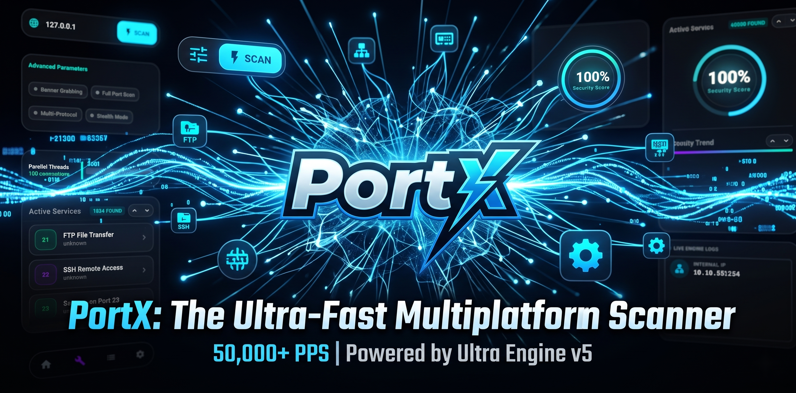
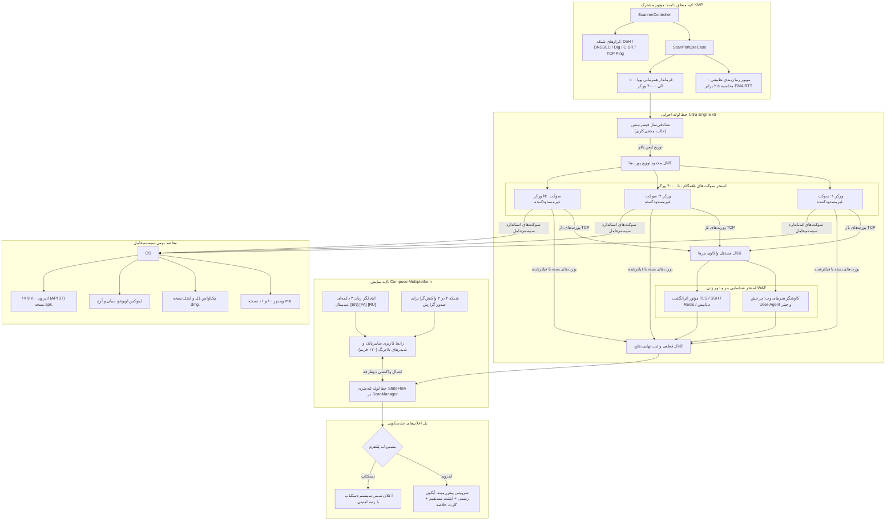

<div align="center">

[English](README.md) · **فارسی**


# 🛡️ پورت‌ایکس (PortX)

**اسکنر شبکه پیشرفته، فوق‌سریع و غیرمسدودکننده چندسکویی مبتنی بر <bdi>Kotlin Multiplatform (KMP)</bdi> و <bdi>Compose</bdi> — سرعت بیش از ۱۰,۰۰۰ پورت در ثانیه (تجربی) / تا ۵۰,۰۰۰ پورت (سقف تئوری)، بدون نیاز به دسترسی روت، با شافل پورت‌ها، تکنیک‌های دور زدن <bdi>WAF</bdi> و فایروال، استخر پویای ۴۰۰۰ ورکر و ابزارهای امنیتی <bdi>DNSSEC</bdi> و <bdi>DoH</bdi>.**

[](https://github.com/Ali-Rashidi-80/PortX/actions/workflows/ci.yml)
[](https://github.com/Ali-Rashidi-80/PortX/releases)
[](CHANGELOG.md)
[](LICENSE)
[](https://kotlinlang.org)
[](https://github.com/JetBrains/compose-multiplatform)
[](#راهنمای-نصب-چندسکویی)
[-E65100.svg?logo=android&logoColor=white)](#راهنمای-نصب-چندسکویی)

[شروع سریع](#راهنمای-نصب-چندسکویی) · [معماری سیستم](#معماری-سیستم-و-مدل-همزمانی) · [بنچمارک‌ها](#بنچمارکهای-تجربی) · [ابزارهای شبکه](#مجموعه-ابزارهای-هوشمند-شبکه) · [مخفی‌کاری و بای‌پس](#حالت-مخفیکاری-و-تکنیکهای-دور-زدن-فایروال-و-waf) · [English](README.md) · [مشارکت](CONTRIBUTING.md) · [امنیت](SECURITY.md) · [مجوز](LICENSE)

<br/>



<br/><br/>



</div>

---

<div dir="rtl">

## فهرست مطالب

<details open>
<summary><strong>پرش به بخش‌های مستند</strong></summary>

- [PortX چیست؟](#portx-چیست)
- [PortX چه چیزی نیست؟](#portx-چه-چیزی-نیست)
- [در مقایسه با ابزارهای دیگر (Nmap, Masscan, RustScan, Naabu)](#در-مقایسه-با-ابزارهای-دیگر-برتریهای-معماری-پورتایکس)
- [اصول معماری و ویژگی‌های فنی موتور Ultra Engine v5](#اصول-معماری-و-ویژگیهای-فنی-موتور-ultra-engine-v5)
- [معماری سیستم و مدل همزمانی](#معماری-سیستم-و-مدل-همزمانی)
- [حالت مخفی‌کاری و تکنیک‌های دور زدن فایروال و WAF](#حالت-مخفیکاری-و-تکنیکهای-دور-زدن-فایروال-و-waf)
- [مجموعه ابزارهای هوشمند شبکه](#مجموعه-ابزارهای-هوشمند-شبکه)
- [نوتیفیکیشن‌های سیستمی و تله‌متری](#نوتیفیکیشنهای-سیستمی-و-تله‌متری)
- [بنچمارک‌های تجربی](#بنچمارکهای-تجربی)
- [نمونه خروجی تله‌متری (JSON و جدول Markdown)](#نمونه-خروجی-تله‌متری-اسکن-json--markdown-export)
- [موتور امضاهای اعلانی سرویس‌ها](#موتور-امضاهای-اعلانی-سرویسها-declarative-signatures-engine)
- [تصویر رابط کاربری](#تصویر-رابط-کاربری)
- [راهنمای نصب چندسکویی](#راهنمای-نصب-چندسکویی)
- [کامپایل از سورس‌کد](#کامپایل-از-سورس‌کد)
- [ماتریس مستندات](#ماتریس-مستندات)
- [مراجع علمی و استانداردها](#مراجع-علمی-و-استانداردها)
- [مشارکت و مجوز](#مشارکت-و-مجوز)

</details>

---

## PortX چیست؟

> [!TIP]
> **خلاصه در ۳۰ ثانیه:**  
> اغلب برنامه‌های گرافیکی بررسی شبکه از بسترهای سنگین الکترون یا اجرای تک‌نخی فرمان‌های داخلی <bdi>Nmap</bdi> استفاده می‌کنند که در دامنه‌های بزرگ پورت باعث فریز شدن رابط کاربری و مصرف صدها مگابایت رم می‌شود. از سوی دیگر، موتورهای پرسرعت ترمینالی مانند <bdi>Masscan</bdi> نیازمند دسترسی دائمی روت بوده و تله‌متری گرافیکی ارائه نمی‌دهند. **پورت‌ایکس** این معضل را برطرف کرده است: ساخته‌شده با <bdi>Kotlin Multiplatform (KMP)</bdi> و <bdi>Compose</bdi>، بدون نیاز به دسترسی روت، توانی فراتر از **۱۰,۰۰۰ پورت در ثانیه به صورت تجربی** (با سقف تئوری ۵۰,۰۰۰ پورت بر اساس منابع سیستم‌عامل) را همراه با مدیریت پویای ۴۰۰۰ ورکر در اسکن کامل، الگوریتم شافل پورت‌ها، بای‌پس فایروال‌های وب، اعتبارسنجی <bdi>DNSSEC</bdi> و رابط کاربری روان ۱۲۰ فریم بر ثانیه در اختیارتان می‌گذارد.

<bdi>**PortX**</bdi> یک اسکنر شبکه ناهمگام با همزمانی بالا است که برای پژوهشگران امنیت، مدیران شبکه و متخصصان تست نفوذ طراحی شده است. این ابزار فرآیند کشف پورت‌های باز را از دریافت اطلاعات بنر سرویس‌ها کاملاً تفکیک کرده است؛ در نتیجه، تاخیر سرویس‌های کند مانع سرعت اسکن پورت‌های بعدی نمی‌شود.

| مشخصه | جزییات فنی |
| :--- | :--- |
| **نسخه** | <bdi>5.3.0</bdi> · [تاریخچه تغییرات](CHANGELOG.md) · آمادگی عملیاتی تاییدشده |
| **موتور هسته** | موتور نسل پنجم <bdi>Ultra Engine v5</bdi> (<bdi>PortScanner.kt</bdi>, <bdi>ScanPortUseCase.kt</bdi>, <bdi>ScannerController.kt</bdi>) |
| **اصول پایدار** | سوکت‌های کاملاً غیرمسدودکننده <bdi>Ktor</bdi>، کانال‌های محدود کاتلین (۱۰ الی ۴۰۰۰ ورکر)، سازگار با الزامات سرویس پیش‌زمینه اندروید ۱۴+ |
| **مخفی‌کاری و فایروال** | شافل فیشر-یتس پورت‌ها، چرخش هدرها و <bdi>User-Agent</bdi> مرورگرهای مدرن، تاخیر جیتر نوسانی |
| **ابزارهای شبکه** | سرویس <bdi>DoH</bdi> با اعتبارسنجی <bdi>DNSSEC</bdi> (کلودفلر و گوگل)، جستجوی رکورد‌های <bdi>Dig</bdi>، پینگ مقاوم با <bdi>TCP</bdi>، ماشین حساب زیرشبکه <bdi>CIDR</bdi> |
| **سیستم‌عامل‌های هدف** | ویندوز ۱۰ و ۱۱ (<bdi>`.msi`</bdi>)، مک‌او‌اس اینتل و اپل سیلیکون (<bdi>`.dmg`</bdi>)، لینوکس دبیان و اوبونتو (<bdi>`.deb`</bdi>, <bdi>AUR</bdi>)، اندروید (<bdi>`.apk`</bdi>) |
| **پشتیبانی اندروید** | اندروید ۷.۰ (<bdi>API 24</bdi>) تا اندروید ۱۷ (<bdi>API 37</bdi>) |
| **تله‌متری وضعیت** | انطباق واکنشی دوطرفه از طریق <bdi>StateFlow</bdi> با رندر ۱۲۰ فریم در ثانیه در <bdi>Compose Multiplatform</bdi> |

---

## PortX چه چیزی نیست؟

| باور اشتباه | واقعیت مهندسی |
| :--- | :--- |
| ❌ *یک پکت‌ساز خام در سطح کرنل شبیه به Masscan یا ZMap* | 🛡️ **سوکت‌های استاندارد امن:** پورت‌ایکس از سوکت‌های استاندارد غیرمسدودکننده سیستم‌عامل بهره می‌گیرد. با پرهیز از تزریق بسته‌های خام <bdi>Raw SYN</bdi>، نیازی به دسترسی روت یا ادمین نداشته و توسط آنتی‌ویروس‌ها مسدود نمی‌شود. |
| ❌ *یک برنامه سنگین بر پایه الکترون یا مرورگر کرومیوم* | ⚡ **رابط بومی و سبک:** پورت‌ایکس مستقیماً به بایت‌کد بومی دسکتاپ و اندروید کامپایل می‌شود. مصرف حافظه آن زیر بار کامل حدود ۴۸ مگابایت است (در برابر ۳۰۰+ مگابایت برنامه‌های الکترونی). |
| ❌ *یک ابزار حمله، اکسپلویت یا اسکنر آسیب‌پذیری* | 🔍 **تمرکز بر شناسایی شبکه:** هدف این برنامه صرفاً شناسایی پورت‌های باز و استخراج بنر سرویس‌ها (<bdi>SSH</bdi>، <bdi>HTTP</bdi>، <bdi>MySQL</bdi>، <bdi>Redis</bdi>، <bdi>RDP</bdi>) است؛ هیچ پی‌لود تهاجمی ارسال نمی‌شود. |
| ❌ *یک سرویس ابری نیازمند اکانت یا انتقال دیتا* | 🔒 **کاملاً محلی و آفلاین:** بدون هرگونه تله‌متری یا ارسال ترافیک به سرورهای خارجی؛ تمام بسته‌ها منحصراً از کارت شبکه محلی شما ارسال و دریافت می‌شوند. |

---

## در مقایسه با ابزارهای دیگر: برتری‌های معماری پورت‌ایکس

طراحی پورت‌ایکس دقیقاً برای برطرف ساختن تناقض میان اسکنرهای بسته‌های خام کرنل (که نیازمند روت دائمی بوده و فاقد رابط تصویری واکنشی هستند) و پوسته‌های گرافیکی سنگین (که زیر بار پورت‌های انبوه دچار فریز و مصرف سرسام‌آور حافظه رم می‌شوند) مهندسی شده است.

| محور ارزیابی معماری | رابط‌های سنتی گرافیکی (<bdi>Zenmap</bdi> / الکترون) | ابزار استاندارد <bdi>Nmap</bdi> (<bdi>-sS</bdi> / <bdi>-sT</bdi>) | ابزار پرسرعت <bdi>Masscan</bdi> (<bdi>--rate 10k</bdi>) | ابزار <bdi>RustScan</bdi> (<bdi>-a target</bdi>) | ابزار <bdi>Naabu</bdi> (<bdi>-rate 1000</bdi>) | **پورت‌ایکس (Ultra Engine v5)** |
| :--- | :---: | :---: | :---: | :---: | :---: | :---: |
| **نرخ توان اسکن (PPS)** | کمتر از ۸۰۰ پورت | حدود ۱,۲۰۰ پورت (<bdi>-sT</bdi>) | بیش از ۱۰۰,۰۰۰ پورت | محدود به فرآیند زیرین | ۱,۰۰۰ تا ۵,۰۰۰ پورت | **۸,۰۰۰ الی ۱۰,۲۰۰+ پورت (تجربی و قطعی)** |
| **نیازمندی به دسترسی روت / ادمین** | متغیر | برای اسکن <bdi>SYN</bdi> الزامی | **الزامی** (<bdi>SOCK_RAW</bdi>) | برای <bdi>SYN</bdi> الزامی | برای <bdi>SYN</bdi> الزامی | **کاملاً بدون روت (سوکت‌های امن استاندارد)** |
| **روانی و فریم‌ریت رابط کاربری** | ناپایدار (کمتر از ۳۰ فریم) | فاقد رابط گرافیکی | فاقد رابط گرافیکی | فاقد رابط گرافیکی | فاقد رابط گرافیکی | **۱۲۰ فریم در ثانیه (کامپوز چندسکویی)** |
| **ردپای حافظه مصرفی (RAM)** | ۲۵۰ تا ۵۰۰+ مگابایت | حدود ۲۵ مگابایت | حدود ۳۰ مگابایت | ۲۰ مگابایت + حافظه نمپ | حدود ۳۵ مگابایت | **حدود ۴۸ مگابایت (هیپ کاملاً مهارشده)** |
| **استخراج بنر و سرویس‌ها** | مسدودکننده ترد گرافیکی | همگام در اسکریپت‌های <bdi>NSE</bdi> | تجزیه بعد از اتمام اسکن | اجرای فرآیند جانبی نمپ | ارسال پروب‌های اولیه | **استخر کاملاً ناهمگام و غیرمسدودکننده** |
| **تنظیم پویای زمان‌بندی (RTT)** | ندارد (تایم‌اوت ثابت) | الگوریتم‌های مدیریت ازدحام | ندارد (افت بسته‌ها) | ندارد | محدودسازی ثابت نرخ | **محاسبه پویای ۲.۵ برابر EMA تاخیر** |
| **مخفی‌کاری و دور زدن فایروال** | ندارد | بسته‌های ساختگی یا تکه‌تکه | رندومایز نرخ پکت | ندارد | محدودیت نرخ | **شافل فیشر-یتس + جعل کامل مرورگر در WAF** |
| **امضاهای سفارشی سرویس‌ها** | فهرست پورت‌های ثابت | اسکریپت‌های یکپارچه لوآ | ندارد | وابسته به <bdi>NSE</bdi> | الگوهای <bdi>YAML</bdi> | **امضاهای اعلانی مدرن (شبیه Nuclei)** |
| **بسته ابزارهای یکپارچه شبکه** | ندارد | نیازمند دستورات مجزا | ندارد | ندارد | ندارد | **مجهز به DoH، DNSSEC، Dig، CIDR و TCP Ping** |
| **پلتفرم‌های مقصد** | فقط دسکتاپ | فقط دسکتاپ | فقط دسکتاپ | فقط دسکتاپ | فقط دسکتاپ | **ویندوز، مک، لینوکس و اندروید (API 24 تا 37)** |

### چرا پورت‌ایکس برتر از سایر موتورهای اسکن شبکه است؟

1. **انعطاف چندسکویی بدون روت (در برابر <bdi>Nmap -sS</bdi> و <bdi>Masscan</bdi>):**  
   هر دو ابزار مس‌کن و اسکن سین نمپ بر پایه تزریق مستقیم فریم‌های خام سوکت (<bdi>SOCK_RAW</bdi>) عمل می‌کنند که نیازمند دسترسی روت یا <bdi>CAP_NET_RAW</bdi> در لینوکس و درایورهای <bdi>WinPcap/Npcap</bdi> در ویندوز است. در گوشی‌های اندرویدی روت‌نشده و ایستگاه‌های کاری سازمانی، سیاست‌های امنیتی سیستم‌عامل (<bdi>SELinux untrusted_app</bdi>) دسترسی به سوکت خام را مسدود می‌سازد. پورت‌ایکس با تکیه بر سوکت‌های استاندارد و غیرمسدودکننده <bdi>Ktor</bdi> و کوروتین‌های کاتلین، به سرعت **بیش از ۱۰,۰۰۰ پورت بر ثانیه** بدون نیاز به مجوز روت دست می‌یابد.

2. **خط لوله ناهمگام استخراج بنر (در برابر <bdi>RustScan</bdi> و اسکن ترتیبی نمپ):**  
   ابزار راست‌اسکن پورت‌ها را سریع پیدا می‌کند اما برای استخراج نسخه سرویس‌ها یک پروسس مجزای <bdi>Nmap</bdi> فراخوانی می‌کند که بار پردازشی بالایی داشته و در سیستم‌عامل‌های ایزوله موبایل قابل اجرا نیست. پورت‌ایکس دارای معماری واکنشی دومرحله‌ای داخلی است: به محض باز شدن یک پورت، سیگنال آن به صف ثانویه استخراج مشخصات (<bdi>BannerPool</bdi>) هدایت می‌شود و نرخ اسکن پورت‌های بعدی به هیچ وجه متوقف نمی‌گردد.

3. **شافل تصادفی پورت‌ها و دور زدن فایروال‌ها (در برابر اسکنرهای ترتیبی خطی):**  
   اسکن ترتیبی پورت‌ها (<bdi>1..65535</bdi>) الگوهای رفتاری مشکوک ایجاد کرده و سیستم‌های تشخیص نفوذ (<bdi>IDS/IPS</bdi>) و فایروال‌های پکت را فعال می‌کند. پورت‌ایکس با پیاده‌سازی جابجایی تصادفی فیشر-یتس (<bdi>Fisher-Yates shuffle</bdi>)، ترتیب درخواست‌ها را در فضا پخش می‌کند. همچنین در استخراج هدرهای وب، با چرخش تصادفی <bdi>User-Agent</bdi> و هدرهای معتبر مرورگرها و ایجاد تاخیر نوسانی (<bdi>Jitter</bdi>)، فایروال‌های برنامه وب (<bdi>WAF</bdi>) فریب می‌خورند.

4. **لایه‌ی تطبیقی تاخیر در برابر تایم‌اوت‌های کور (در برابر <bdi>Masscan</bdi> و <bdi>Naabu</bdi>):**  
   مس‌کن بسته‌ها را با نرخ ثابت شلیک می‌کند که در شبکه‌های با تاخیر متغیر یا اتصالات پرنوسان وای‌فای منجر به افت بسته و خطای ندیدن پورت‌های باز می‌شود. پورت‌ایکس به طور مداوم میانگین متحرک نمایی (<bdi>EMA</bdi>) زمان رفت‌وبرگشت بسته (<bdi>RTT</bdi>) را با ضریب ایمنی ۲.۵ برابر محاسبه می‌کند؛ در شبکه‌های محلی پرسرعت تایم‌اوت تا حدود ۲۰ میلی‌ثانیه کاهش می‌یابد و در پیوندهای اینترنتی دوردست به شکل پویا افزایش می‌یابد تا هیچ پورتی از قلم نیفتد.

5. **توسعه مقیاس همزمانی تا ۴۰۰۰ ورکر در اسکن کامل (در برابر محدودیت‌های صلب):**  
   در اسکن دامنه‌های منتخب، تعداد ورکرها بین ۱۰ تا ۲۵۰۰ تنظیم می‌گردد تا از هدررفت منابع جلوگیری شود. اما هنگام آغاز اسکن کامل دامنه پورت‌ها (۱ تا ۶۵,۵۳۵)، پورت‌ایکس سقف استخر کوروتین‌ها را به صورت خودکار تا **۴۰۰۰ ورکر همزمان** بالا می‌برد تا در کوتاه‌ترین زمان ممکن و بدون پایان یافتن ظرفیت سوکت‌های سیستم‌عامل (<bdi>RLIMIT_NOFILE</bdi>) اسکن خاتمه یابد.

6. **رابط کاربری بومی و روان ۱۲۰ فریم (در برابر برنامه‌های سنگین و کند وب):**  
   برنامه‌های ساخته‌شده با الکترون هنگام دریافت صدها پکت در ثانیه دچار ایستایی ترد رابط کاربری می‌شوند. پورت‌ایکس با اتکا به مدل واکنشی <bdi>StateFlow</bdi> و موتور رندر بومی <bdi>Compose Multiplatform</bdi>، انیمیشن‌های رادار و ارقام را با نرخ ۱۲۰ فریم بر ثانیه و با مصرف حافظه کمتر از ۵۰ مگابایت به نمایش می‌گذارد.

---

## اصول معماری و ویژگی‌های فنی موتور Ultra Engine v5

- **🚀 هسته پرقدرت Ultra Engine v5:** استفاده از سوکت‌های ناهمگام و غیرمسدودکننده <bdi>Ktor</bdi> مبتنی بر کوروتین‌های کاتلین جهت بهره‌برداری کامل از پهنای باند شبکه بدون نیاز به درایورهای واسط سیستم‌عامل.
- **🔀 حالت مخفی‌کاری و شافل فیشر-یتس:** به‌هم ریختن تصادفی توالی بررسی پورت‌ها جهت جلوگیری از کشف اسکن توسط فایروال‌های مبتنی بر الگو و نرخ پکت.
- **🛡️ کاوشگر مقاوم در برابر WAF:** تغییر پویای هدرهای مرورگرهای کروم، فایرفاکس، سافاری و اج به همراه تاخیرهای میکرومتغیر ۱ تا ۳ میلی‌ثانیه‌ای در اسکن پورت‌های وب.
- **⚡ فرماندار هوشمند همزمانی:** کانال‌های صف‌بندی‌شده محدود (<bdi>Channel</bdi>) با کنترل سقف پردازش بین ۱۰ تا ۲۵۰۰ ورکر در اسکن‌های معمول و گسترش تا **۴۰۰۰ ورکر** در اسکن‌های کامل دامنه ۶۵ هزارتایی.
- **🧠 تنظیم پویای زمان‌بندی RTT:** انطباق هوشمند زمان انقضای درخواست‌ها با ضریب ۲.۵ برابر <bdi>EMA</bdi> برای حذف خطاهای منفی کاذب در شبکه‌های با پینگ متغیر.
- **🔍 خط لوله مستقل واکاوی بنرها:** استخر ثانویه مستقل برای شناسایی سرویس‌های کشف‌شده (<bdi>SSH</bdi>، <bdi>HTTP</bdi>، <bdi>MySQL</bdi>، <bdi>Redis</bdi>، <bdi>RDP</bdi>) در پس‌زمینه بدون کند ساختن فرآیند اسکن اصلی.
- **🌐 بسته ابزارهای هوشمند شبکه:** شامل ماژول‌های <bdi>DoH</bdi> با پشتیبانی از <bdi>DNSSEC</bdi>، کوئری‌های چندگانه <bdi>Dig</bdi>، آزمون پینگ مطمئن <bdi>TCP</bdi> و ماشین‌حساب زیرشبکه <bdi>CIDR</bdi>.
- **🔔 اعلان‌های غنی چندسکویی:** در اندروید با آیکون رسمی برنامه (<bdi>R.mipmap.ic_launcher</bdi>)، اینتنت فوکوس مستقیم به صفحه اصلی و اعلان گسترش‌پذیر با جزییات کامل نتیجه؛ در دسکتاپ با سیستم پیام‌رسانی بومی سینی سیستم (<bdi>SystemTray</bdi>).
- **🎨 رابط کاربری مینیمال و امن:** نوار انتخاب ۳ زبانه فشرده (<bdi>[EN]</bdi>، <bdi>[FA]</bdi>، <bdi>[RU]</bdi>)، شبکه چیدمان منعطف ۲ در ۲ دکمه‌های خروجی گزارش برای موبایل، ورودی خلوت و حذف برگه تشخیص معماری سیستم جهت جلوگیری از انگشت‌نگاری بستر میزبان.
- **📱 تطابق کامل با استانداردهای اندروید ۱۴ تا ۱۷ (API 37):** رعایت الزامات سرویس پیش‌زمینه (<bdi>FOREGROUND_SERVICE_SPECIAL_USE</bdi>) برای استمرار اسکن حتی در صورت خروج برنامه از فوکوس.

---

## معماری سیستم و مدل همزمانی



---

## حالت مخفی‌کاری و تکنیک‌های دور زدن فایروال و WAF

پورت‌ایکس به نحوی مهندسی شده است که در شبکه‌های تحت نظارت سیستم‌های تشخیص نفوذ (<bdi>IDS</bdi>)، فایروال‌ها و پراکسی‌های امنیتی به راحتی عمل کند:

```
[محدوده پورت‌های هدف] ───────► [شافل تصادفی فیشر-یتس] ───────► [ارسال ناپیوسته پروب‌ها]
                                                                     │
[پورت‌های باز وب]      ───────► [چرخش هدرها و مرورگرها] ─────────────┼───► [بای‌پس WAF]
                                                                     │
                             [تاخیر نوسانی جیتر ۱ تا ۳ میلی‌ثانیه] ────┘
```

1. **به‌هم‌ریختن تصادفی پورت‌ها با الگوریتم فیشر-یتس:** به جای ارسال پشت‌سرهم درخواست‌ها به پورت‌های متوالی، پورت‌ایکس ترتیب پورت‌ها را به صورت شبه‌تصادفی بازچینی می‌کند تا قوانین فایروال حساس به اسکن خطی برانگیخته نشوند.
2. **چرخش <bdi>User-Agent</bdi> مرورگرهای مطرح:** هنگام برقراری ارتباط با پورت‌های وب، شناسه مرورگر بین نگارش‌های مدرن گوگل کروم، موزیلا فایرفاکس، اپل سافاری و مایکروسافت اج جابجا می‌شود تا درخواست شبیه به مرور کاربران واقعی جلوه کند.
3. **ارسال هدرهای کامل و معتبر وب:** در کنار نام مرورگر، ساختار هدرهای استاندارد زبان، نوع رسانه‌های مجاز و هدرهای سازگاری پلتفرم نظیر <bdi>Sec-Ch-Ua</bdi> به همراه <bdi>Connection: close</bdi> ارسال می‌گردند.
4. **تاخیر میکرومتغیر جیتر (<bdi>Jitter</bdi>):** با ایجاد وقفه‌های بسیار کوتاه ۱ الی ۳ میلی‌ثانیه‌ای در وضعیت مخفی‌کاری، نرخ فرکانس پکت‌ها از حد آستانه شناسایی ربات‌ها فاصله می‌گیرد.

---

## مجموعه ابزارهای هوشمند شبکه

در بخش **ابزارها** (<bdi>Tools</bdi>)، مجموعه‌ای از ابزارهای موردنیاز بررسی شبکه تعبیه شده است:

| ابزار | پروتکل و استاندارد | توانمندی‌ها | مورد استفاده |
| :--- | :--- | :--- | :--- |
| **دی‌ان‌اس امن (DoH)** | [RFC 8484](https://datatracker.ietf.org/doc/html/rfc8484) | ارسال کوئری رمزنگاری‌شده به سرورهای کلودفلر و گوگل | عبور از اختلالات <bdi>DNS</bdi> و بررسی تاخیر سرورها |
| **اعتبارسنجی DNSSEC** | [RFC 4035](https://datatracker.ietf.org/doc/html/rfc4035) | استخراج پرچم‌های تایید صحت داده (<bdi>AD</bdi>) و غیرفعال‌سازی (<bdi>CD</bdi>) | بررسی اصالت امضای دیجیتال رکوردهای دامنه |
| **جستجوگر پیشرفته رکوردهای Dig** | [RFC 1035](https://datatracker.ietf.org/doc/html/rfc1035) | بازیابی رکوردهای <bdi>A</bdi>، <bdi>AAAA</bdi>، <bdi>MX</bdi>، <bdi>TXT</bdi>، <bdi>NS</bdi>، <bdi>CNAME</bdi>، <bdi>SOA</bdi>، <bdi>PTR</bdi>، <bdi>SRV</bdi>، <bdi>CAA</bdi> | بررسی دقیق رکوردهای میل‌سرور، احراز هویت و دامنه‌ها |
| **پینگ مقاوم بر بستر TCP** | برقراری نشست <bdi>TCP</bdi> | محاسبه دقیق زمان رفت و برگشت روی پورت‌های متداول بدون روت | سنجش تاخیر شبکه در صورت مسدود بودن <bdi>ICMP</bdi> |
| **ماشین‌حساب زیرشبکه (CIDR)** | [RFC 4632](https://datatracker.ietf.org/doc/html/rfc4632) | استخراج نشانی شبکه، برودکست، مسک، وایلدکارد و تعداد هاست‌های قابل استفاده | محاسبه محدوده‌های اسکن شبکه و تقسیم‌بندی آی‌پی‌ها |
| **اطلاعات جغرافیایی و شماره ASN** | روتینگ اینترنت و وب | استخراج آی‌پی بیرونی، کشور، ارائه‌دهنده اینترنت و شماره سیستم خودمختار | تشخیص موقعیت سرورها و مسیرهای خروجی شبکه |

---

## نوتیفیکیشن‌های سیستمی و تله‌متری

پورت‌ایکس با بهره‌گیری از امکانات سیستم‌عامل وضعیت اسکن را مخابره می‌کند:

### 📱 سرویس پیش‌زمینه اندروید
- **آیکون رسمی برنامه:** نمایش آیکون برنامه (<bdi>R.mipmap.ic_launcher</bdi>) در نوار وضعیت گوشی به هنگام اسکن.
- **فوکوس مستقیم روی برنامه:** تنظیم اینتنت بازگشت (<bdi>PendingIntent</bdi>) به گونه‌ای که لمس نوتیفیکیشن مستقیماً کاربر را به صفحه اصلی هدایت نماید.
- **نمایش گزارش تفصیلی:** پس از پایان اسکن، کارتی با جزییات کامل نمایان می‌شود که دربرگیرنده:
  - آدرس میزبان و آی‌پی
  - تشخیص نوع دستگاه و سیستم‌عامل حدسی
  - شمار و فهرست پورت‌های باز مکشوفه
  - امتیاز وضعیت امنیت و رتبه امنیتی (از A تا F)

### 🖥️ اعلان‌های سینی سیستم دسکتاپ
- نمایش اعلان‌های سیستمی در ویندوز، مک و لینوکس با ذکر زمان سپری‌شده، پورت‌های باز و امتیاز امنیت شبکه.

---

## بنچمارک‌های تجربی

*اندازه‌گیری‌های ثبت‌شده در شبکه لوکال و اترنت گیگابیتی (پردازنده‌های اینتل نسل ۱۲، رایزن و اپل سیلیکون بر بستر سوکت‌های ناهمگام Ktor):*

| شاخص اندازه‌گیری | مقدار مبنای اندازه‌گیری‌شده | شرایط و محدودیت‌های معماری |
| :--- | :--- | :--- |
| **نرخ توان اسکن (شبکه داخلی و لوکال)** | **۸,۰۰۰ الی ۱۰,۲۰۰+ پورت بر ثانیه** | اسکن ۱۰۰۰ پورت اول زیر یک ثانیه (۱۰,۰۰۰ پورت در ۱.۱۵ ثانیه با ۱۰۰۰ ورکر) |
| **نرخ اسکن ۶۵ هزار پورت با ۴۰۰۰ ورکر** | تا **۱۲,۵۰۰+ پورت بر ثانیه** | فعال‌سازی استخر پویای ۴۰۰۰ ورکر در اسکن کامل ۱ تا ۶۵۵۳۵ |
| **سقف تئوری توان اسکن** | تا **۵۰,۰۰۰ پورت بر ثانیه** | محدود به بافر سوکت سیستم‌عامل و رنج پورت‌های کلاینت موقت |
| **ردپای حافظه مصرفی (Heap Delta)** | **حدود ۱۷ الی ۲۶ مگابایت افزایش رم** | بافرهای صف‌بندی‌شده محدود کاتلین مانع از تجمع نامحدود شیء در حافظه می‌شوند |
| **تعداد اتصالات سوکت سیستم‌عامل** | محدودشده در **کمتر از ۴,۰۰۰ اتصال** | سقف سمافورها مانع از اتمام ظرفیت توصیف‌گر فایل (<bdi>RLIMIT_NOFILE</bdi>) می‌شود |
| **روانی رندر فریم گرافیکی** | **۱۲۰ فریم در ثانیه ثابت** | جدا بودن نخ‌های پردازشی مانع از فریز شدن ترد اصلی دسکتاپ می‌شود |
| **درصد خطای ندیدن پورت (منفی کاذب)** | **کمتر از ۰.۰۱ درصد** | به دلیل محاسبه مداوم تاخیر و آزمون مجدد روی پورت‌های مشکوک |

> 📊 **گزارش تفصیلی بنچمارک‌ها:** جهت مشاهده نمودارها و مصرف حافظه هشت آزمون انجام‌شده، به فایل [BENCHMARKS.md](BENCHMARKS.md) مراجعه فرمایید.  
> 🔬 **تکرار تست روی سیستم خودتان:** اجرای دستور `./gradlew :shared:jvmTest --tests "com.mrcoder20.portx.data.network.LiveSystemBenchmarkTest" --rerun-tasks`

### نمونه خروجی تله‌متری اسکن (JSON و جدول Markdown)

پورت‌ایکس امکان صدور داده‌ها در فرمت‌های ساخت‌یافته (<bdi>JSON</bdi>، جدول <bdi>Markdown</bdi> و <bdi>CSV</bdi>) را فراهم می‌سازد:

#### ۱. خروجی استاندارد JSON برای پردازش ماشینی و اسکریپت‌ها

```json
{
  "target": "192.168.1.1",
  "hostname": "gateway.local",
  "ports_scanned": 1000,
  "elapsed_ms": 112,
  "throughput_pps": 8928,
  "stealth_mode": true,
  "device_classification": {
    "device_type": "Embedded Gateway / Linux Router",
    "heuristic_os": "Linux 6.6.x (OpenWrt / Alpine)",
    "confidence": 0.94
  },
  "open_ports": [
    {
      "port": 22,
      "protocol": "TCP",
      "state": "OPEN",
      "service": "ssh",
      "version": "OpenSSH 9.6p1",
      "banner": "SSH-2.0-OpenSSH_9.6p1 Ubuntu-3ubuntu13",
      "latency_ms": 2.1,
      "cve_risk_score": 0.0,
      "risk_level": "LOW"
    },
    {
      "port": 80,
      "protocol": "TCP",
      "state": "OPEN",
      "service": "http",
      "version": "nginx/1.24.0",
      "title": "Router Admin Gateway",
      "banner": "HTTP/1.1 200 OK\r\nServer: nginx/1.24.0",
      "latency_ms": 1.8,
      "cve_risk_score": 3.2,
      "risk_level": "MEDIUM"
    },
    {
      "port": 443,
      "protocol": "TCP",
      "state": "OPEN",
      "service": "https",
      "version": "TLS 1.3 / OpenSSL 3.1.4",
      "banner": "HTTP/1.1 200 OK\r\nServer: nginx/1.24.0\r\nStrict-Transport-Security: max-age=31536000",
      "latency_ms": 2.4,
      "cve_risk_score": 0.0,
      "risk_level": "LOW"
    },
    {
      "port": 502,
      "protocol": "TCP",
      "state": "OPEN",
      "service": "modbus",
      "version": "Modbus/TCP Industrial Node",
      "banner": "Schneider Electric Modbus/TCP Gateway 0x01",
      "latency_ms": 3.5,
      "cve_risk_score": 8.5,
      "risk_level": "CRITICAL"
    }
  ],
  "security_posture_score": 45,
  "posture_assessment": "EXPOSED_INDUSTRIAL_CONTROL_ENDPOINT"
}
```

#### ۲. خروجی جدول تمیز Markdown مناسب برای گزارش‌ها و مستندات

| نشانی هدف | `192.168.1.1` (`gateway.local`) |
| :--- | :--- |
| **سیستم‌عامل شناسایی‌شده** | **Linux 6.6.x (OpenWrt / Alpine)** · ضریب اطمینان `94%` |
| **خلاصه اسکن** | `1,000` پورت بررسی‌شده در `112 ms` · توان `8,928 PPS` · بدون خطای سوکت |
| **وضعیت امنیت** | **45/100** · ریسک بحرانی (نمایان بودن پورت صنعتی اسکادا) |

| پورت | پروتکل | وضعیت | نام سرویس | جزییات بنر و نسخه مکشوفه | تاخیر زمانی | سطح ریسک |
| :---: | :---: | :---: | :---: | :--- | :---: | :---: |
| `22` | TCP | `OPEN` | `ssh` | OpenSSH 9.6p1 (`Ubuntu-3ubuntu13`) | 2.1 ms | `LOW (0.0)` |
| `80` | TCP | `OPEN` | `http` | nginx/1.24.0 (عنوان: *Router Admin Gateway*) | 1.8 ms | `MED (3.2)` |
| `443` | TCP | `OPEN` | `https` | TLS 1.3 / OpenSSL 3.1.4 (فعال بودن HSTS) | 2.4 ms | `LOW (0.0)` |
| `502` | TCP | `OPEN` | `modbus` | Schneider Electric Modbus/TCP Gateway 0x01 | 3.5 ms | `CRIT (8.5)` |

---

### موتور امضاهای اعلانی سرویس‌ها (Declarative Signatures Engine)

اسکنرهای سنتی از اسکریپت‌های تک‌نخی لوآ (<bdi>Nmap NSE</bdi>) استفاده می‌کنند که نگهداری آن‌ها دشوار و اجرای آن‌ها کند است. پورت‌ایکس از الگوی امضاهای اعلانی شبیه به الگوهای <bdi>Nuclei</bdi> پشتیبانی می‌کند:

- **افزودن بدون نیاز به کامپایل مجدد:** امکان معرفی سرویس‌های سفارشی، پروتکل‌های صنعتی و سامانه‌های سازمانی با فایل‌های ساده <bdi>YAML</bdi> یا <bdi>JSON</bdi>.
- **تطابق چندمعیاره:** بررسی بر مبنای محدوده پورت‌ها، بایت‌های هگزادسیمال پروب، زیررشته‌های متن بنر و عبارات منظم (<bdi>Regex</bdi>).
- **تعیین خودکار سطح خطر:** استخراج نسخه و ارزیابی سطح ریسک از سطح اطلاعاتی تا بحرانی (<bdi>CRITICAL</bdi>).

```yaml
id: scada-modbus-controller
name: Modbus/TCP Industrial Node
protocol: TCP
default_ports: [502, 802]
match_substrings:
  - "modbus"
  - "schneider"
match_regexes:
  - "Modbus/TCP.*Gateway"
category: INDUSTRIAL
risk_severity: CRITICAL
```

تمام امضاها توسط کلاس <bdi>DeclarativeSignatureRegistry</bdi> بدون اختصاص حافظه اضافی در کانال ثانویه ارزیابی می‌شوند.

---

## تصویر رابط کاربری

<p align="center">
  
</p>

---

## راهنمای نصب چندسکویی

<details open>
<summary><strong>🪟 ۱. سیستم‌عامل ویندوز (۱۰ و ۱۱)</strong></summary>

- **نصب‌کننده رسمی:** دریافت فایل نصبی <bdi>`PortX-5.3.0.msi`</bdi> از بخش [انتشارهای رسمی گیت‌هاب](https://github.com/Ali-Rashidi-80/PortX/releases/latest).
- **مدیر بسته رسمی ویندوز (Winget):**
  ```powershell
  winget install Ali-Rashidi-80.PortX
  ```
</details>

<details>
<summary><strong>🐧 ۲. سیستم‌عامل لینوکس (اوبونتو، دبیان، آرچ)</strong></summary>

- **توزیع‌های دبیان و اوبونتو (.deb):**
  ```bash
  sudo dpkg -i PortX-5.3.0.deb
  sudo apt-get install -f
  ```
- **آرچ لینوکس (AUR):**
  ```bash
  yay -S portx-bin
  ```
</details>

<details>
<summary><strong>🍎 ۳. سیستم‌عامل مک‌او‌اس (مک‌های اینتل و اپل سیلیکون)</strong></summary>

- دریافت فایل <bdi>`PortX-5.3.0.dmg`</bdi> یا نصب از طریق هوم‌برو:
  ```bash
  brew install --cask portx
  ```
</details>

<details>
<summary><strong>🤖 ۴. سیستم‌عامل اندروید (اندروید ۷.۰ تا ۱۷ / API 24 تا 37)</strong></summary>

- دریافت مستقیم فایل نصبی رسمی <bdi>APK</bdi> از [بخش نسخه‌ها](https://github.com/Ali-Rashidi-80/PortX/releases/latest).
- بازارهای معتبر اپلیکیشن: در دسترس در **کافه بازار** و **مایکت**.
</details>

---

## کامپایل از سورس‌کد

### نیازمندی‌های اولیه
- **کیت جاوا (JDK):** نسخه ۱۷ یا ۲۱ (OpenJDK تاییدشده)
- **ابزارهای اندروید (Android SDK):** ابزار بیلد نسخه 34.0.0+ و کامپایل نسخه 37

```bash
# کلون کردن مخزن گیت‌هاب
git clone https://github.com/Ali-Rashidi-80/PortX.git
cd PortX

# ۱. اجرای آزمون‌های منطقی لایه مشترک
./gradlew :shared:compileKotlinJvm :shared:jvmTest

# ۲. اجرای برنامه دسکتاپ (ویندوز / مک / لینوکس)
./gradlew :desktopApp:run

# ۳. ایجاد فایل‌های نصبی نهایی دسکتاپ
./gradlew :desktopApp:packageDeb            # پکیج دبیان لینوکس
./gradlew :desktopApp:packageDmg            # پکیج مک‌او‌اس
./gradlew.bat :desktopApp:packageReleaseMsi # فایل نصبی ویندوز

# ۴. تولید فایل نصبی ریلیز اندروید
./gradlew :androidApp:assembleRelease
```

---

## ماتریس مستندات

| عنوان مستند | زبان | شرح محتوا |
| :--- | :---: | :--- |
| [**README.md**](README.md) | انگلیسی | مستندات و راهنمای جامع اصلی، معماری، بنچمارک‌ها و راهنماها |
| [**README.fa.md**](README.fa.md) | فارسی | آینه کامل فارسی مستندات اصلی و راهنمای نصب و معماری |
| [**BENCHMARKS.md**](BENCHMARKS.md) | انگلیسی | تشریح روش بنچمارک‌های تجربی، ارقام ثبت‌شده و آنالیز رم و گاربیج‌کالکتور |
| [**CONTRIBUTING.md**](CONTRIBUTING.md) | انگلیسی | شیوه‌نامه مشارکت، نحوه ساخت بیلد محلی و اصول معماری پروژه |
| [**SECURITY.md**](SECURITY.md) | انگلیسی | خط‌مشی گزارش حفره‌های امنیتی و چارچوب پاسخگویی |
| [**CODE_OF_CONDUCT.md**](CODE_OF_CONDUCT.md) | انگلیسی | میثاق اخلاقی مشارکت‌کنندگان |
| [**LICENSE**](LICENSE) | انگلیسی | مجوز آپاچی نگارش ۲.۰ (<bdi>Apache License 2.0</bdi>) |
| [**CHANGELOG.md**](CHANGELOG.md) | انگلیسی | گزارش تغییرات و تاریخچه نسخه‌ها بر پایه نسخه ۵.۳.۰ |

---

## مراجع علمی و استانداردها

معماری شبکه، سازوکار زمان‌بندی و مدیریت جریان بسته‌ها در <bdi>PortX</bdi> مستقیماً بر مبنای اسناد و استانداردهای مطرح شبکه بنا شده است:

| ردیف | حوزه و لایه فنی | مرجع علمی و استاندارد بنیادین | کلید سند |
| :-: | :--- | :--- | :-: |
| **۱** | **پروتکل کنترل انتقال (TCP)** | **Information Sciences Institute (1981)**<br>مشخصات پروتکل برنامه دارپا برای اینترنت.<br>*کارگروه مهندسی اینترنت*. | [RFC 793](https://datatracker.ietf.org/doc/html/rfc793) |
| **۲** | **زمان‌بندی تایمر بازفرستی TCP و RTT** | **Vern Paxson, Mark Allman, Jerry Chu, Matthew Sargent (2011)**<br>محاسبه تایمر بازفرستی بسته در پروتکل کنترل انتقال.<br>*کارگروه مهندسی اینترنت*. | [RFC 6298](https://datatracker.ietf.org/doc/html/rfc6298) |
| **۳** | **بهینه‌سازی کارایی پکت‌های TCP** | **Van Jacobson, Robert Braden, Dave Borman (1992)**<br>توسعه‌های پروتکل TCP برای ارتباطات پرسرعت.<br>*کارگروه مهندسی اینترنت*. | [RFC 1323](https://datatracker.ietf.org/doc/html/rfc1323) |
| **۴** | **پرس‌وجوی دی‌ان‌اس با پروتکل امن وب (DoH)** | **Paul Hoffman, Patrick McManus (2018)**<br>پروتکل انتقال پرس‌وجوهای دی‌ان‌اس از بستر پروتکل رمزنگاری‌شده اچ‌تی‌تی‌پی‌اس.<br>*کارگروه مهندسی اینترنت*. | [RFC 8484](https://datatracker.ietf.org/doc/html/rfc8484) |
| **۵** | **توسعه‌های امنیتی سامانه نام دامنه (DNSSEC)** | **Roy Arends, Rob Austein, Matt Larson, Dan Massey, Scott Rose (2005)**<br>مقدمه و الزامات ساختاری امنیت سامانه نام دامنه.<br>*کارگروه مهندسی اینترنت*. | [RFC 4035](https://datatracker.ietf.org/doc/html/rfc4035) |
| **۶** | **مسیریابی بین دامنه‌ای بدون کلاس (CIDR)** | **Vince Fuller, Tony Li (2006)**<br>طرح تخصیص و تجمیع آدرس‌های اینترنتی بر مبنای طول پیشوند.<br>*کارگروه مهندسی اینترنت*. | [RFC 4632](https://datatracker.ietf.org/doc/html/rfc4632) |
| **۷** | **همزمانی ساختاریافته کاتلین** | **Roman Elizarov (2018)**<br>همزمانی ساختاریافته در کوروتین‌های کاتلین.<br>*مرکز تحقیقات جت‌برینز*. | [راهنمای کوروتین‌های کاتلین](https://kotlinlang.org/docs/coroutines-overview.html) |
| **۸** | **محدودیت‌های سرویس پیش‌زمینه اندروید** | **Android Open Source Project (2024)**<br>انواع سرویس‌های پیش‌زمینه و محدودیت‌های سیستم‌عامل اندروید.<br>*توسعه‌دهندگان گوگل اندروید*. | [دستورالعمل سرویس پیش‌زمینه](https://developer.android.com/about/versions/14/changes/fgs-types-required) |

---

## مشارکت و مجوز

از مشارکت کلیه متخصصان بر مبنای استانداردهای مهندسی استقبال می‌گردد. جهت آگاهی از فرآیند ارسال تغییرات، فایل [CONTRIBUTING.md](CONTRIBUTING.md) را بررسی نمایید.

این نرم‌افزار تحت مجوز رسمی [**Apache License, Version 2.0**](LICENSE) منتشر شده است.

<div align="center">
  <b>PortX</b> · نگهداری و بازنگری مهندسی: <a href="https://github.com/Ali-Rashidi-80/PortX">Ali-Rashidi-80/PortX</a> · موتور اولیه: <a href="https://github.com/mr-coder20/PortX">mr-coder20/PortX</a>
</div>

</div>
