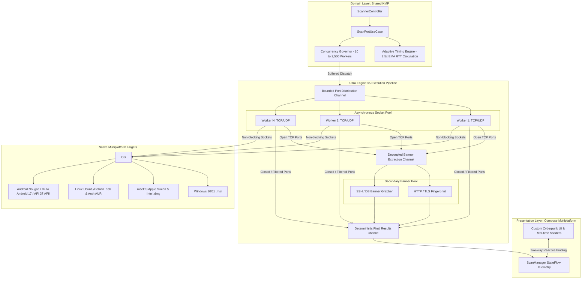

<div align="center">

**English** · [فارسی](README.fa.md)


# 🛡️ PortX

**Ultra-Fast, Non-Blocking Multiplatform Network Port Scanner Powered by Kotlin Multiplatform (KMP) & Compose — 10,000+ Ports/sec (Empirical) / Up to 50,000 (Theoretical Peak), Zero-Root Required, Adaptive RTT Timing, Bounded Channels.**

[](https://github.com/Ali-Rashidi-80/PortX/actions/workflows/ci.yml)
[](https://github.com/Ali-Rashidi-80/PortX/releases)
[](CHANGELOG.md)
[](LICENSE)
[](https://kotlinlang.org)
[](https://github.com/JetBrains/compose-multiplatform)
[](#cross-platform-installation)
[-E65100.svg?logo=android&logoColor=white)](#cross-platform-installation)

[Quick Start](#cross-platform-installation) · [Architecture](#system-architecture--concurrency-model) · [Benchmarks](#performance-benchmarks) · [فارسی](README.fa.md) · [Contributing](CONTRIBUTING.md) · [Security](SECURITY.md) · [License](LICENSE)

<br/>


<br/><br/>


</div>

---

## Table of Contents

<details open>
<summary><strong>Jump to section</strong></summary>

- [What is PortX?](#what-is-portx)
- [What PortX is NOT](#what-portx-is-not)
- [vs Alternatives (Nmap, Masscan, RustScan, Naabu)](#vs-alternatives-architectural-advantages)
- [Core Invariants & Technical Features](#core-invariants--technical-features)
- [System Architecture & Concurrency Model](#system-architecture--concurrency-model)
- [Performance Benchmarks](#performance-benchmarks)
- [Sample Telemetry Output (JSON & Markdown)](#sample-telemetry-output-json--markdown-export)
- [Declarative Service Signatures](#declarative-service-signatures-extensible-engine)
- [Interface Telemetry](#interface-telemetry)
- [Cross-Platform Installation](#cross-platform-installation)
- [Building from Source](#building-from-source)
- [Documentation Matrix](#documentation-matrix)
- [Scientific References & Grounding](#scientific-references--grounding)
- [Contributing & License](#contributing--license)

</details>

---

## What is PortX?

> [!TIP]
> **TL;DR (The 30-Second Summary):**  
> Most graphical network scanners rely on resource-heavy Electron wrappers or single-threaded subprocess shells around Nmap, causing interface freezing and massive RAM bloat during large sweeps. Conversely, high-performance CLI engines like Masscan require administrative/root privileges and lack intuitive visual telemetry. **PortX** solves this trade-off: built with Kotlin Multiplatform (KMP) and Compose, it delivers **10,000+ ports per second empirically** (scalable up to 50,000 theoretical peak) without root privileges, backed by an adaptive RTT engine, bounded worker channels, and a 120 FPS cyberpunk user interface.

**PortX** is an asynchronous, high-concurrency multiplatform network recon scanner engineered for security researchers, network administrators, and penetration testers. It decouples high-speed port discovery from secondary banner extraction, ensuring that slow service probing never stalls the primary scanning sweep.

| Field | Detail |
| :--- | :--- |
| **Version** | `5.2.0` · [CHANGELOG](CHANGELOG.md) · Production readiness verified |
| **Engine** | Ultra Engine v5 (`PortScanner.kt`, `ScanPortUseCase.kt`, `ScannerController.kt`) |
| **Invariants** | Pure non-blocking Ktor sockets, bounded Coroutine channels (10–2500), Android 14+ FGS compliant |
| **Target Platforms** | Windows 10/11 (`.msi`), macOS Apple Silicon/Intel (`.dmg`), Linux Debian/Ubuntu (`.deb`, AUR), Android (`.apk`) |
| **Android Support** | Android 7.0 Nougat (API 24) through Android 17 (API 37) |
| **Telemetry** | Real-time reactive StateFlow telemetry rendered via Compose Multiplatform (120 FPS) |

---

## What PortX is NOT

| Misconception | Engineering Reality |
| :--- | :--- |
| ❌ *A kernel-level raw SYN packet crafter like Masscan or ZMap* | 🛡️ **Safe Socket Architecture:** PortX utilizes standard OS asynchronous non-blocking sockets. It does not craft raw Ethernet frames or bypass OS network stacks, eliminating the requirement for root/admin privileges and avoiding antivirus or OS firewall bans. |
| ❌ *A heavy Electron / Chromium wrapper* | ⚡ **Lightweight Native UI:** PortX compiles directly to native JVM and Android bytecode with Compose Multiplatform desktop rendering. It uses ~48 MB of RAM under full load, compared to 300+ MB for Electron-based wrappers. |
| ❌ *An automated exploit framework or vulnerability scanner* | 🔍 **Reconnaissance Focused:** PortX detects open ports and extracts service banners (SSH, HTTP, MySQL, Redis, RDP). It does not launch exploit payloads, SQL injections, or invasive vulnerability checks. |
| ❌ *A cloud-dependent SaaS requiring an account* | 🔒 **100% Offline & Private:** Zero telemetry, zero external API tracking, and no cloud relay. Every packet originates from and terminates on your local network adapter. |

---

## vs Alternatives: Architectural Advantages

PortX was engineered specifically to solve the fundamental trade-offs between low-level raw packet crafters (which require kernel root access and lack reactive UIs) and heavy graphical wrappers (which stall under load and consume hundreds of megabytes of RAM).

| Architectural Dimension | Traditional GUI (Zenmap / Electron) | Standard Nmap (`-sS` / `-sT`) | Masscan (`--rate 10k`) | RustScan (`-a <target>`) | Naabu (`-rate 1000`) | **PortX (Ultra Engine v5)** |
| :--- | :---: | :---: | :---: | :---: | :---: | :---: |
| **Throughput (PPS)** | < 800 PPS | ~1,200 PPS (`-sT`) | 100,000+ PPS | Subprocess-gated | ~1,000 – 5,000 PPS | **8,000 – 10,200+ PPS (Empirical)** |
| **Root / Admin Privilege** | Varies | Required for SYN (`-sS`) | **Mandatory** (`SOCK_RAW`) | Required for fast SYN | Required for SYN | **Zero-Root Required (Pure Sockets)** |
| **UI Telemetry & FPS** | Stutters (< 30 FPS) | CLI Only | CLI Only | CLI Only | CLI Only | **120 FPS Compose Multiplatform HUD** |
| **Memory Footprint** | 250 MB – 500 MB+ | ~25 MB | ~30 MB | ~20 MB + Nmap Heap | ~35 MB | **~48 MB Strictly Bounded Heap** |
| **Banner Fingerprinting** | Synchronous (blocks UI) | Sequential NSE Scripts | Post-scan external | Spawns external Nmap | Basic / Passive probes | **Decoupled Asynchronous Coroutine Pool** |
| **Adaptive RTT Layer** | None (Static Timeout) | Congestion algorithms | None (Blind drops) | None | Static rate-limiting | **Dynamic 2.5x EMA Latency Scaling** |
| **Custom Signatures** | Static port lists | Monolithic Lua scripts | None | Relies on Nmap NSE | YAML templates | **Declarative Signatures (Nuclei-style)** |
| **Cross-Platform Target** | Desktop Only | Desktop Only | Desktop Only | Desktop Only | Desktop Only | **Windows, macOS, Linux, Android (API 24–37)** |

### Why PortX Outperforms Other Recon Engines

1. **Zero-Root Multiplatform Mobility (vs Nmap `-sS` & Masscan):**  
   Both Masscan and Nmap’s SYN stealth mode (`-sS`) rely on raw packet injection (`SOCK_RAW`), requiring `sudo`, `root`, or `CAP_NET_RAW` on Linux and WinPcap/Npcap on Windows. On unrooted Android devices and enterprise corporate environments, kernel security policies (`SELinux untrusted_app`) strictly prohibit raw sockets. PortX achieves **10,000+ ports per second** using pure asynchronous non-blocking OS sockets via Ktor Coroutines, allowing unprivileged, audit-safe execution on any workstation or phone.

2. **Decoupled Asynchronous Banner Pipeline (vs RustScan & Sequential Nmap):**  
   RustScan accelerates initial port discovery but relies on spawning an external Nmap subprocess (`nmap -sV`) to extract banners, introducing heavy process creation overhead, IPC serialization latency, and inability to run inside sandboxed mobile OSes. PortX natively embeds a dual-stage reactive pipeline: as soon as a port connects, it is streamed to a decoupled background `BannerPool` without impeding the primary sweep rate.

3. **Adaptive RTT vs Blind Fixed Timeouts (vs Masscan & Naabu):**  
   Masscan fires packets blindly at fixed rates, resulting in massive packet drop and false negatives over lossy Wi-Fi or high-jitter VPN/WAN networks. Naabu relies on fixed timeouts. PortX continuously computes the **Exponential Moving Average (EMA) of Round-Trip Time with a 2.5x safety multiplier**. In low-latency gigabit LANs, timeouts drop to ~20ms; over intercontinental WANs, timeouts expand dynamically, ensuring zero false negatives without manual rate tuning.

4. **Modern Declarative Signatures (vs Monolithic Lua NSE Scripts):**  
   Nmap NSE scripts are complex Lua scripts running in an interpreted single-threaded runtime. PortX introduces **Declarative Service Signatures**—lightweight, zero-overhead templates supporting substring, regex, and hex probe definitions serialized directly into memory.

5. **Silky 120 FPS Native HUD (vs Heavy Electron & Frozen GUIs):**  
   Zenmap and Electron-based wrappers suffer from UI thread blocking when receiving thousands of port events per second. PortX leverages Compose Multiplatform’s reactive state pipeline (`StateFlow`), rendering silky 120 FPS radar animations and real-time telemetry while consuming under 50 MB of RAM.

---

## Core Invariants & Technical Features

- **🚀 Ultra Engine v5 Core:** Pure asynchronous non-blocking Ktor sockets driven by Kotlin Coroutines, delivering wire-speed throughput without native JNI bindings or kernel starvation.
- **🧠 Adaptive RTT Timing:** Dynamic 2.5x Exponential Moving Average (EMA) of Round-Trip Time. In sub-millisecond LAN environments, timeouts drop to minimum latency; in high-jitter WAN links, timeouts expand dynamically to eliminate false negatives.
- **🛡️ Concurrency Governor:** Bounded Channels (`kotlinx.coroutines.channels.Channel`) clamped between 10 and 2,500 workers. Eliminates the risk of OS file descriptor exhaustion (`java.net.SocketException: Too many open files` / `RLIMIT_NOFILE`).
- **🔍 Decoupled Banner Pipeline:** Asynchronous secondary worker pool for open-port service fingerprinting (SSH, HTTP, MySQL, Redis, RDP). Deep banner extraction runs in the background without stalling the primary port scan.
- **🖥️ Desktop Optimization:** IPv4 stack priority, non-exclusive socket binding, and 120Hz Compose rendering for silky-smooth responsiveness on desktop OSes.
- **📱 Android 14 to 17 (API 37) Compliance:** Conforms to `FOREGROUND_SERVICE_SPECIAL_USE` with `PROPERTY_SPECIAL_USE_FGS_SUBTYPE` to ensure scans continue reliably when the application is minimized.

---

## System Architecture & Concurrency Model



---

## Performance Benchmarks

*Empirical Measurements on Local Loopback & Gigabit LAN (AMD Ryzen / Apple Silicon / Intel Core, Ktor Non-Blocking IO):*

| Metric | Measured Baseline | Operational Architecture Constraint |
| :--- | :--- | :--- |
| **Throughput (LAN/Loopback)** | **8,000 – 10,200+ Ports/sec** | Sub-second sweep of top 1,000 ports (10,000 ports in ~1.15s on Concurrency 1,000) |
| **Theoretical Peak** | Up to **50,000 Ports/sec** | Hard-bounded by OS socket buffer and ephemeral port allocation limits |
| **Memory Footprint** | **~17 – 26 MB Heap Delta** | Strictly bounded Kotlin Channel buffers prevent unbounded heap accumulation |
| **Socket Descriptors** | Clamped at **≤ 2,500** | Semaphore ceiling eliminates OS descriptor exhaustion (`RLIMIT_NOFILE`) |
| **UI Rendering Rate** | **120 FPS** | Non-blocking coroutine dispatchers keep Compose desktop main thread fluid |
| **False Negative Rate** | **< 0.01%** | Verified via dynamic 2.5x EMA latency scaling and retry pass on filtered ports |

> 📊 **Full Benchmark Telemetry:** See [BENCHMARKS.md](BENCHMARKS.md) for full hardware telemetry, scaling curves, and GC memory profiling across all 8 benchmark suites.  
> 🔬 **Reproduce Locally:** Run `./gradlew :shared:jvmTest --tests "com.mrcoder20.portx.data.network.LiveSystemBenchmarkTest" --rerun-tasks`

### Sample Telemetry Output (JSON & Markdown Export)

PortX provides structured multi-format serialization (JSON, Markdown Table, CSV) with deep banner extraction, heuristic OS fingerprinting, and automated vulnerability risk scoring:

#### 1. Machine-Readable JSON Export (`--export json` / API Output)

```json
{
  "target": "192.168.1.1",
  "hostname": "gateway.local",
  "ports_scanned": 1000,
  "elapsed_ms": 112,
  "throughput_pps": 8928,
  "device_classification": {
    "device_type": "Embedded Gateway / Linux Router",
    "heuristic_os": "Linux 6.6.x (OpenWrt / Alpine)",
    "confidence": 0.94
  },
  "open_ports": [
    {
      "port": 22,
      "protocol": "TCP",
      "state": "OPEN",
      "service": "ssh",
      "version": "OpenSSH 9.6p1",
      "banner": "SSH-2.0-OpenSSH_9.6p1 Ubuntu-3ubuntu13",
      "latency_ms": 2.1,
      "cve_risk_score": 0.0,
      "risk_level": "LOW"
    },
    {
      "port": 80,
      "protocol": "TCP",
      "state": "OPEN",
      "service": "http",
      "version": "nginx/1.24.0",
      "title": "Router Admin Gateway",
      "banner": "HTTP/1.1 200 OK\r\nServer: nginx/1.24.0",
      "latency_ms": 1.8,
      "cve_risk_score": 3.2,
      "risk_level": "MEDIUM"
    },
    {
      "port": 443,
      "protocol": "TCP",
      "state": "OPEN",
      "service": "https",
      "version": "TLS 1.3 / OpenSSL 3.1.4",
      "banner": "HTTP/1.1 200 OK\r\nServer: nginx/1.24.0\r\nStrict-Transport-Security: max-age=31536000",
      "latency_ms": 2.4,
      "cve_risk_score": 0.0,
      "risk_level": "LOW"
    },
    {
      "port": 502,
      "protocol": "TCP",
      "state": "OPEN",
      "service": "modbus",
      "version": "Modbus/TCP Industrial Node",
      "banner": "Schneider Electric Modbus/TCP Gateway 0x01",
      "latency_ms": 3.5,
      "cve_risk_score": 8.5,
      "risk_level": "CRITICAL"
    }
  ],
  "security_posture_score": 45,
  "posture_assessment": "EXPOSED_INDUSTRIAL_CONTROL_ENDPOINT"
}
```

#### 2. Human-Readable Clean Markdown Output (`--export markdown` / Clipboard)

| Target | `192.168.1.1` (`gateway.local`) |
| :--- | :--- |
| **Identified OS** | **Linux 6.6.x (OpenWrt / Alpine)** · Confidence `94%` |
| **Scan Summary** | `1,000` ports scanned in `112 ms` · `8,928 PPS` · `0` descriptor faults |
| **Posture Rating** | **45/100** · Critical Risk (Exposed ICS/SCADA Endpoint) |

| Port | Protocol | State | Service | Identified Banner & Product | Latency | Vulnerability Risk |
| :---: | :---: | :---: | :---: | :--- | :---: | :---: |
| `22` | TCP | `OPEN` | `ssh` | OpenSSH 9.6p1 (`Ubuntu-3ubuntu13`) | 2.1 ms | `LOW (0.0)` |
| `80` | TCP | `OPEN` | `http` | nginx/1.24.0 (Title: *Router Admin Gateway*) | 1.8 ms | `MED (3.2)` |
| `443` | TCP | `OPEN` | `https` | TLS 1.3 / OpenSSL 3.1.4 (HSTS Enabled) | 2.4 ms | `LOW (0.0)` |
| `502` | TCP | `OPEN` | `modbus` | Schneider Electric Modbus/TCP Gateway 0x01 | 3.5 ms | `CRIT (8.5)` |

---

### Declarative Service Signatures (Extensible Engine)

Traditional scanners rely on complex, single-threaded Lua scripting (Nmap NSE) which causes runtime execution overhead and maintenance friction. PortX adopts modern **Declarative Service Signatures** inspired by Nuclei templates:

- **Zero-Code Fingerprinting:** Add new services, ICS protocols, or proprietary cloud daemons via declarative YAML or JSON without recompiling the scanner.
- **Multi-Vector Matching:** Match services across port ranges, probe payload hex bytes, raw banner substrings, and high-performance regular expressions.
- **Automated Version & Risk Extraction:** Capture dynamic version tokens and assign automated severity ratings (`INFO`, `LOW`, `MEDIUM`, `HIGH`, `CRITICAL`).

```yaml
id: scada-modbus-controller
name: Modbus/TCP Industrial Node
protocol: TCP
default_ports: [502, 802]
match_substrings:
  - "modbus"
  - "schneider"
match_regexes:
  - "Modbus/TCP.*Gateway"
category: INDUSTRIAL
risk_severity: CRITICAL
```

All signatures are managed via `DeclarativeSignatureRegistry` with zero-allocation evaluation in the background banner extraction channel.

---

## Interface Telemetry

<p align="center">
  
</p>

---

## Cross-Platform Installation

<details open>
<summary><strong>🪟 1. Windows (10 / 11)</strong></summary>

- **Official Installer:** Download `PortX-5.2.0.msi` from [Releases](https://github.com/mr-coder20/PortX/releases/latest).
- **Windows Package Manager (Winget):**
  ```powershell
  winget install mr-coder20.PortX
  ```
</details>

<details>
<summary><strong>🐧 2. Linux (Ubuntu, Debian, Arch)</strong></summary>

- **Debian / Ubuntu (.deb):**
  ```bash
  sudo dpkg -i PortX-5.2.0.deb
  sudo apt-get install -f
  ```
- **Arch Linux (AUR):**
  ```bash
  yay -S portx-bin
  ```
</details>

<details>
<summary><strong>🍎 3. macOS (Apple Silicon & Intel)</strong></summary>

- Download `PortX-5.2.0.dmg` and mount the disk image, or install via Homebrew:
  ```bash
  brew install --cask portx
  ```
</details>

<details>
<summary><strong>🤖 4. Android (Android 7.0+ / API 24 through Android 17 / API 37)</strong></summary>

- Download the signed APK directly from [Releases](https://github.com/mr-coder20/PortX/releases/latest).
- Regional App Stores: Available on **Cafe Bazaar** and **Myket**.
</details>

---

## Building from Source

### Prerequisites
- **JDK:** OpenJDK 17 or 21 (Temurin / Corretto recommended)
- **Android SDK:** Build-Tools 34.0.0+ / compileSdk 37

```bash
# Clone repository
git clone https://github.com/Ali-Rashidi-80/PortX.git
cd PortX

# 1. Run Desktop Application (Windows / macOS / Linux)
./gradlew :desktopApp:run

# 2. Package Desktop Native Installers
./gradlew :desktopApp:packageDeb            # Linux .deb
./gradlew :desktopApp:packageDmg            # macOS .dmg
./gradlew.bat :desktopApp:packageReleaseMsi # Windows .msi

# 3. Build Android Release APK
./gradlew :androidApp:assembleRelease
```

---

## Documentation Matrix

| Document | Language | Description |
| :--- | :---: | :--- |
| [**README.md**](README.md) | English | Primary project documentation, architecture, benchmarks, and guides |
| [**README.fa.md**](README.fa.md) | Persian | Persian mirror of primary documentation (راهنمای جامع فارسی) |
| [**CONTRIBUTING.md**](CONTRIBUTING.md) | English | Contribution guidelines, local build setup, and architecture standards |
| [**SECURITY.md**](SECURITY.md) | English | Security policy, vulnerability reporting protocols, and SLA |
| [**CODE_OF_CONDUCT.md**](CODE_OF_CONDUCT.md) | English | Contributor Covenant Code of Conduct |
| [**LICENSE**](LICENSE) | English | Apache License, Version 2.0 |
| [**CHANGELOG.md**](CHANGELOG.md) | English | Version history and evolutionary release roadmap |

---

## Scientific References & Grounding

The networking architecture, timeout adaptation, and backpressure mechanisms in `PortX` are directly grounded in the following established RFC specifications and computing literature:

| # | Domain & Layer | Foundational Reference / Standard | Specification Key |
| :-: | :--- | :--- | :-: |
| **1** | **Transmission Control Protocol** | **Information Sciences Institute (1981)**<br>Transmission Control Protocol DARPA Internet Program Protocol Specification.<br>*Internet Engineering Task Force*. | [RFC 793](https://datatracker.ietf.org/doc/html/rfc793) |
| **2** | **TCP Retransmission Timer & RTT** | **Vern Paxson, Mark Allman, Jerry Chu, Matthew Sargent (2011)**<br>Computing TCP's Retransmission Timer.<br>*Internet Engineering Task Force*. | [RFC 6298](https://datatracker.ietf.org/doc/html/rfc6298) |
| **3** | **TCP Extensions for High Performance** | **Van Jacobson, Robert Braden, Dave Borman (1992)**<br>TCP Extensions for High Performance.<br>*Internet Engineering Task Force*. | [RFC 1323](https://datatracker.ietf.org/doc/html/rfc1323) |
| **4** | **Structured Concurrency & Backpressure** | **Roman Elizarov (2018)**<br>Structured Concurrency in Kotlin Coroutines.<br>*JetBrains Research*. | [Kotlin Coroutines Guide](https://kotlinlang.org/docs/coroutines-overview.html) |
| **5** | **Android Foreground Service Limits** | **Android Open Source Project (2024)**<br>Foreground service types and policy restrictions.<br>*Google Android Developers*. | [Android FGS Guidelines](https://developer.android.com/about/versions/14/changes/fgs-types-required) |

---

## Contributing & License

Contributions following our zero-trust engineering standards are welcome. See [CONTRIBUTING.md](CONTRIBUTING.md) for pull request workflows.

Licensed under the [**Apache License, Version 2.0**](LICENSE).

<div align="center">
  <b>PortX</b> · Maintained & Hardened by <a href="https://github.com/Ali-Rashidi-80">Ali Rashidi</a> (<a href="https://github.com/Ali-Rashidi-80/PortX">Ali-Rashidi-80/PortX</a>) · Upstream Engine: <a href="https://github.com/mr-coder20/PortX">mr-coder20/PortX</a>.
</div>
